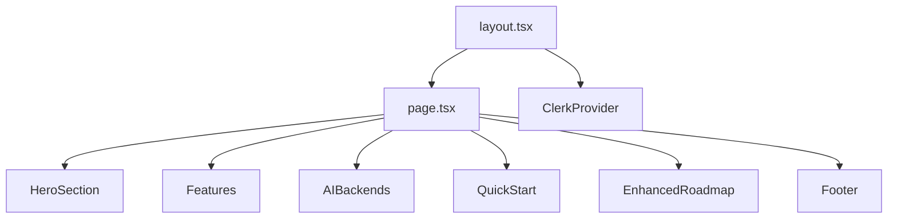
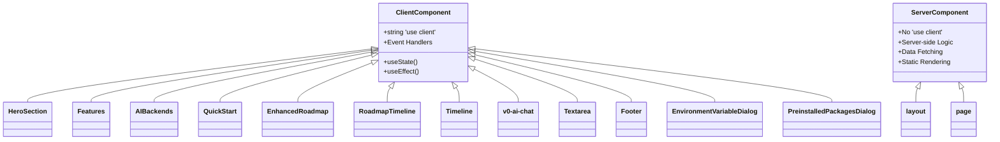
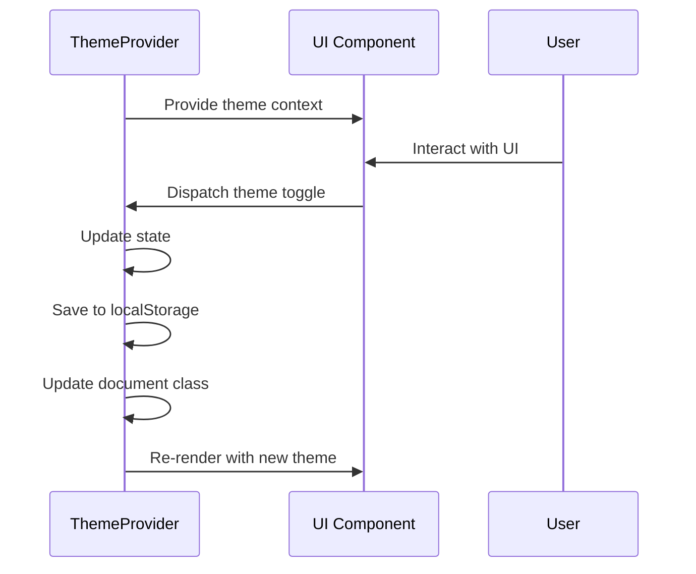
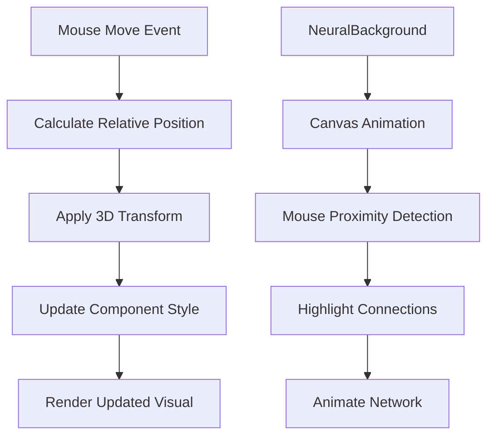
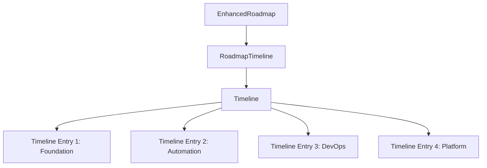
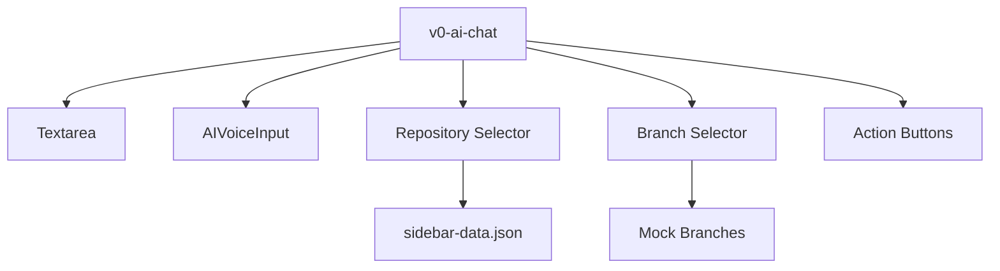
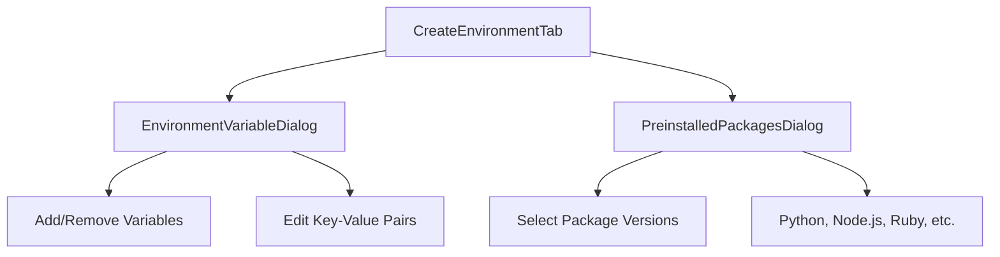

# Component Architecture

<cite>
**Referenced Files in This Document**   
- [layout.tsx](file://src\app\layout.tsx)
- [page.tsx](file://src\app\page.tsx)
- [EnhancedRoadmap.tsx](file://src\components\EnhancedRoadmap.tsx) - *Added in recent commit*
- [roadmap-timeline.tsx](file://src\components\ui\roadmap-timeline.tsx) - *Added in recent commit*
- [timeline.tsx](file://src\components\ui\timeline.tsx) - *Added in recent commit*
- [v0-ai-chat.tsx](file://src\components\ui\v0-ai-chat.tsx) - *Updated with sidebar and textarea*
- [textarea.tsx](file://src\components\ui\textarea.tsx) - *Added in recent commit*
- [sidebar-data.json](file://src\json\sidebar-data.json) - *Updated with repository data*
- [EnvironmentVariableDialog.tsx](file://src\components\settings\dialogs\EnvironmentVariableDialog.tsx) - *Added in recent commit*
- [PreinstalledPackagesDialog.tsx](file://src\components\settings\dialogs\PreinstalledPackagesDialog.tsx) - *Added in recent commit*
- [CreateEnvironmentTab.tsx](file://src\components\settings\tabs\CreateEnvironmentTab.tsx) - *Uses new dialog components*
</cite>

## Update Summary
**Changes Made**   
- Added new section on Environment Management Components to document the EnvironmentVariableDialog and PreinstalledPackagesDialog components
- Updated Client-Server Component Boundary section to include new settings dialog components
- Added new diagram for environment management component hierarchy
- Updated referenced files list to include all newly added and modified files
- Updated Component Composition in Main Page section to reflect integration of new dialog components

## Table of Contents
1. [Component Architecture Overview](#component-architecture-overview)
2. [Core Component Hierarchy](#core-component-hierarchy)
3. [Client-Server Component Boundary](#client-server-component-boundary)
4. [Data Flow and State Management](#data-flow-and-state-management)
5. [Theme Context System](#theme-context-system)
6. [Interactive Visual Effects](#interactive-visual-effects)
7. [Component Composition in Main Page](#component-composition-in-main-page)
8. [Roadmap Visualization Components](#roadmap-visualization-components)
9. [AI Chat Interface Components](#ai-chat-interface-components)
10. [Environment Management Components](#environment-management-components)

## Component Architecture Overview

The async_coder frontend follows a modular, component-based architecture built on React and Next.js App Router conventions. The application is structured around reusable UI components that are composed together to create the complete user interface. The architecture emphasizes separation of concerns, reusability, and maintainability through a clear component hierarchy and well-defined data flow patterns.

The application leverages Next.js App Router for routing and server-side rendering, while using React's component model for UI construction. Client components are explicitly marked with the 'use client' directive to enable interactivity, while server components handle initial rendering and data fetching. This hybrid approach optimizes performance by minimizing client-side JavaScript while maintaining rich interactive experiences where needed.

**Section sources**
- [layout.tsx](file://src\app\layout.tsx)
- [page.tsx](file://src\app\page.tsx)

## Core Component Hierarchy

The component hierarchy begins with the root layout.tsx file, which defines the overall structure of the application and wraps all pages with necessary providers. The page.tsx file serves as the main entry point for the homepage, composing various high-level sections into the complete page.



**Diagram sources**
- [layout.tsx](file://src\app\layout.tsx)
- [page.tsx](file://src\app\page.tsx)

**Section sources**
- [layout.tsx](file://src\app\layout.tsx)
- [page.tsx](file://src\app\page.tsx)

## Client-Server Component Boundary

The application implements a clear boundary between client and server components using React's 'use client' directive. Components that require interactivity, such as those handling user events or maintaining state, are designated as client components. This pattern optimizes performance by allowing server components to render static content efficiently while reserving client-side JavaScript for interactive elements.



**Diagram sources**
- [HeroSection.tsx](file://src\components\ui\hero-section-1.tsx)
- [Features.tsx](file://src\components\Features.tsx)
- [AIBackends.tsx](file://src\components\AIBackends.tsx)
- [QuickStart.tsx](file://src\components\QuickStart.tsx)
- [EnhancedRoadmap.tsx](file://src\components\EnhancedRoadmap.tsx)
- [roadmap-timeline.tsx](file://src\components\ui\roadmap-timeline.tsx)
- [timeline.tsx](file://src\components\ui\timeline.tsx)
- [v0-ai-chat.tsx](file://src\components\ui\v0-ai-chat.tsx)
- [textarea.tsx](file://src\components\ui\textarea.tsx)
- [Footer.tsx](file://src\components\Footer.tsx)
- [EnvironmentVariableDialog.tsx](file://src\components\settings\dialogs\EnvironmentVariableDialog.tsx)
- [PreinstalledPackagesDialog.tsx](file://src\components\settings\dialogs\PreinstalledPackagesDialog.tsx)

**Section sources**
- [HeroSection.tsx](file://src\components\ui\hero-section-1.tsx)
- [Features.tsx](file://src\components\Features.tsx)
- [AIBackends.tsx](file://src\components\AIBackends.tsx)
- [QuickStart.tsx](file://src\components\QuickStart.tsx)
- [EnhancedRoadmap.tsx](file://src\components\EnhancedRoadmap.tsx)
- [roadmap-timeline.tsx](file://src\components\ui\roadmap-timeline.tsx)
- [timeline.tsx](file://src\components\ui\timeline.tsx)
- [v0-ai-chat.tsx](file://src\components\ui\v0-ai-chat.tsx)
- [textarea.tsx](file://src\components\ui\textarea.tsx)
- [Footer.tsx](file://src\components\Footer.tsx)
- [EnvironmentVariableDialog.tsx](file://src\components\settings\dialogs\EnvironmentVariableDialog.tsx)
- [PreinstalledPackagesDialog.tsx](file://src\components\settings\dialogs\PreinstalledPackagesDialog.tsx)

## Data Flow and State Management

The application employs a combination of React's built-in state management hooks and context API for data flow. Client components use useState for local component state and useEffect for side effects. The context API is used for global state that needs to be accessed across multiple components, such as theme preferences.



**Diagram sources**
- [ThemeProvider.tsx](file://src\app\components\ThemeProvider.tsx)

**Section sources**
- [ThemeProvider.tsx](file://src\app\components\ThemeProvider.tsx)

## Theme Context System

The theme context system is implemented using React's Context API, allowing theme state to be shared across the entire application. The ThemeProvider component manages the current theme state and provides a toggle function to switch between light and dark modes. The theme state is persisted in localStorage to maintain user preferences across sessions.

```typescript
// ThemeProvider.tsx
const ThemeContext = createContext<ThemeContextType | undefined>(undefined)

export function ThemeProvider({ children }: { children: React.ReactNode }) {
  const [theme, setTheme] = useState<Theme>('light')
  
  useEffect(() => {
    const savedTheme = localStorage.getItem('theme') as Theme | null
    if (savedTheme) {
      setTheme(savedTheme)
    }
  }, [])
  
  useEffect(() => {
    if (theme === 'dark') {
      document.documentElement.classList.add('dark')
    } else {
      document.documentElement.classList.remove('dark')
    }
    localStorage.setItem('theme', theme)
  }, [theme])
  
  const toggleTheme = () => {
    setTheme((prevTheme) => (prevTheme === 'dark' ? 'light' : 'dark'))
  }
  
  return (
    <ThemeContext.Provider value={{ theme, toggleTheme }}>
      {children}
    </ThemeContext.Provider>
  )
}
```

The theme context is consumed by components using the useTheme hook, which provides type-safe access to the theme state and toggle function. This pattern ensures consistent theme behavior across all components while minimizing prop drilling.

**Section sources**
- [ThemeProvider.tsx](file://src\app\components\ThemeProvider.tsx)

## Interactive Visual Effects

Several components implement interactive visual effects that respond to user input, particularly mouse movement. These effects enhance user engagement and provide visual feedback. The HeroSection, LiveDiffDemo, and Footer components all utilize mouse position data to create 3D transform effects, while the NeuralBackground component creates an interactive neural network visualization.



**Diagram sources**
- [HeroSection.tsx](file://src\app\components\HeroSection.tsx)
- [LiveDiffDemo.tsx](file://src\app\components\LiveDiffDemo.tsx)
- [Footer.tsx](file://src\app\components\Footer.tsx)
- [NeuralBackground.tsx](file://src\app\components\NeuralBackground.tsx)

**Section sources**
- [HeroSection.tsx](file://src\app\components\HeroSection.tsx)
- [LiveDiffDemo.tsx](file://src\app\components\LiveDiffDemo.tsx)
- [Footer.tsx](file://src\app\components\Footer.tsx)
- [NeuralBackground.tsx](file://src\app\components\NeuralBackground.tsx)

## Component Composition in Main Page

The main page (page.tsx) serves as a composition layer that assembles various high-level components into a cohesive user experience. The page follows a structured layout with distinct sections, each implemented as a separate component. This compositional approach enables independent development and testing of each section while ensuring a consistent overall design.

```typescript
// page.tsx composition pattern
export default function Home() {
  return (
    <div className="relative min-h-screen">
      {/* Raycast Animated Background for entire page */}
      <div className="fixed inset-0 z-0">
        <RaycastBackground />
      </div>
      
      {/* New Hero Section with integrated navigation */}
      <div className="relative z-10">
        <HeroSection />
      </div>
      
      {/* Remaining content sections */}
      <div className="relative z-10">
        <Features />
        <AIBackends />
        <QuickStart />
        <EnhancedRoadmap />
        <Footer />
      </div>
    </div>
  );
}
```

Each section component is responsible for a specific aspect of the user experience:
- **HeroSection**: Introduction and value proposition with integrated navigation
- **Features**: Detailed feature showcase
- **AIBackends**: AI backend capabilities and integration
- **QuickStart**: Getting started guide and onboarding
- **EnhancedRoadmap**: Development roadmap with timeline visualization
- **Footer**: Additional navigation and contact information

This composition pattern follows React best practices by creating small, focused components that can be easily maintained and reused. Props are used to pass data and configuration between components, while context is used for global state like theme preferences.

**Section sources**
- [page.tsx](file://src\app\page.tsx)
- [HeroSection.tsx](file://src\components\ui\hero-section-1.tsx)
- [Features.tsx](file://src\components\Features.tsx)
- [AIBackends.tsx](file://src\components\AIBackends.tsx)
- [QuickStart.tsx](file://src\components\QuickStart.tsx)
- [EnhancedRoadmap.tsx](file://src\components\EnhancedRoadmap.tsx)
- [Footer.tsx](file://src\components\Footer.tsx)

## Roadmap Visualization Components

The roadmap visualization system consists of three main components that work together to create an interactive development roadmap: EnhancedRoadmap, RoadmapTimeline, and Timeline. These components were recently added to provide users with a clear view of the project's development progress and future plans.

The EnhancedRoadmap component serves as the main container for the roadmap section, providing the overall structure, header, and community engagement elements. It imports and renders the RoadmapTimeline component which organizes the roadmap data into phases with visual content.



**Diagram sources**
- [EnhancedRoadmap.tsx](file://src\components\EnhancedRoadmap.tsx)
- [roadmap-timeline.tsx](file://src\components\ui\roadmap-timeline.tsx)
- [timeline.tsx](file://src\components\ui\timeline.tsx)

The RoadmapTimeline component defines the roadmap data structure with four phases: Foundation, Automation, DevOps, and Platform. Each phase includes descriptive content, status indicators using Lucide icons (CheckCircle, Clock, Wrench, Search), and supporting images. The component uses the Timeline component to render this data in a visually appealing format.

The Timeline component is a reusable UI element that creates a vertical timeline with animated progress indicators. It uses framer-motion for scroll-based animations that reveal timeline entries as the user scrolls. The component calculates the scroll progress and transforms it into height and opacity values for the progress bar.

```typescript
// timeline.tsx
export const Timeline = ({ data }: { data: TimelineEntry[] }) => {
  const ref = useRef<HTMLDivElement>(null);
  const containerRef = useRef<HTMLDivElement>(null);
  const [height, setHeight] = useState(0);

  useEffect(() => {
    if (ref.current) {
      const rect = ref.current.getBoundingClientRect();
      setHeight(rect.height);
    }
  }, [ref]);

  const { scrollYProgress } = useScroll({
    target: containerRef,
    offset: ["start 10%", "end 50%"],
  });

  const heightTransform = useTransform(scrollYProgress, [0, 1], [0, height]);
  const opacityTransform = useTransform(scrollYProgress, [0, 0.1], [0, 1]);

  return (
    <div ref={containerRef}>
      {/* Timeline entries and animated progress bar */}
    </div>
  );
};
```

**Section sources**
- [EnhancedRoadmap.tsx](file://src\components\EnhancedRoadmap.tsx)
- [roadmap-timeline.tsx](file://src\components\ui\roadmap-timeline.tsx)
- [timeline.tsx](file://src\components\ui\timeline.tsx)

## AI Chat Interface Components

The AI chat interface has been enhanced with new components that improve user interaction and provide better access to codebase information. The main components involved are v0-ai-chat, textarea, and the sidebar functionality that displays repository data.

The v0-ai-chat component implements a comprehensive AI chat interface with multiple features:
- Repository and branch selection dropdowns
- Voice input capability
- Action buttons for common tasks
- Auto-resizing textarea for input
- Support for file attachments



**Diagram sources**
- [v0-ai-chat.tsx](file://src\components\ui\v0-ai-chat.tsx)
- [textarea.tsx](file://src\components\ui\textarea.tsx)
- [sidebar-data.json](file://src\json\sidebar-data.json)

The textarea component is a reusable UI element that provides an auto-resizing text input field. It uses the cn utility for conditional class names and supports all standard textarea attributes. The component is designed to be used in the AI chat interface where users need to input queries about their code.

```typescript
// textarea.tsx
const Textarea = React.forwardRef<HTMLTextAreaElement, React.TextareaHTMLAttributes<HTMLTextAreaElement>>(
  ({ className, ...props }, ref) => {
    return (
      <textarea
        className={cn(
          "flex min-h-[80px] w-full rounded-md border border-input bg-background px-3 py-2 text-sm ring-offset-background placeholder:text-muted-foreground focus-visible:outline-none focus-visible:ring-2 focus-visible:ring-ring focus-visible:ring-offset-2 disabled:cursor-not-allowed disabled:opacity-50",
          className
        )}
        ref={ref}
        {...props}
      />
    )
  }
)
```

The repository and branch selection functionality uses data from sidebar-data.json to populate the dropdown menus. The component maintains state for the selected repository and branch, and displays notifications for repositories with updates. The sidebar data includes information about codebases, recent tasks, and footer links.

```typescript
// v0-ai-chat.tsx
const sidebarData = {
  "recentTasks": [...],
  "codebases": [
    {
      "id": "async_coder",
      "name": "async_coder",
      "owner": "pschoudhary-dot",
      "fullName": "pschoudhary-dot/async_coder",
      "description": "The last AI assistant you'll ever need for coding",
      "language": "TypeScript",
      "isPrivate": false,
      "hasNotifications": true,
      "notificationCount": 1
    },
    // Additional codebases...
  ],
  "dailyTaskLimit": {
    "current": 0,
    "maximum": 15
  },
  "footerLinks": [...]
};
```

The component uses custom hooks like useAutoResizeTextarea to manage the textarea height dynamically based on content. It also handles keyboard events (Enter to send, Shift+Enter for new line) and implements click-outside detection to close dropdown menus.

**Section sources**
- [v0-ai-chat.tsx](file://src\components\ui\v0-ai-chat.tsx)
- [textarea.tsx](file://src\components\ui\textarea.tsx)
- [sidebar-data.json](file://src\json\sidebar-data.json)

## Environment Management Components

The environment management system has been enhanced with new dialog components that allow users to configure environment variables, secrets, and preinstalled packages when creating development environments. These components were recently added to support the environment creation workflow in the settings section.

The EnvironmentVariableDialog component provides a reusable interface for managing key-value pairs, with support for both environment variables and secrets. The component uses different input types (text vs password) based on the type parameter, providing appropriate security for sensitive data.



**Diagram sources**
- [EnvironmentVariableDialog.tsx](file://src\components\settings\dialogs\EnvironmentVariableDialog.tsx)
- [PreinstalledPackagesDialog.tsx](file://src\components\settings\dialogs\PreinstalledPackagesDialog.tsx)
- [CreateEnvironmentTab.tsx](file://src\components\settings\tabs\CreateEnvironmentTab.tsx)

The EnvironmentVariableDialog component supports multiple variable entries with the ability to add or remove entries. Each variable has a key and value field, with validation to prevent removal of the last entry. The component is used twice in the CreateEnvironmentTab - once for environment variables and once for secrets, demonstrating its reusability.

```typescript
// EnvironmentVariableDialog.tsx
export function EnvironmentVariableDialog({ 
  open, 
  onOpenChange,
  title,
  type
}: EnvironmentVariableDialogProps) {
  const [variables, setVariables] = useState<Variable[]>([
    { id: '1', key: '', value: '' }
  ]);

  const addVariable = () => {
    const newId = Date.now().toString();
    setVariables(prev => [...prev, { id: newId, key: '', value: '' }]);
  };

  const removeVariable = (id: string) => {
    if (variables.length > 1) {
      setVariables(prev => prev.filter(v => v.id !== id));
    }
  };

  const updateVariable = (id: string, field: 'key' | 'value', value: string) => {
    setVariables(prev => prev.map(v => 
      v.id === id ? { ...v, [field]: value } : v
    ));
  };

  return (
    <Dialog open={open} onOpenChange={onOpenChange}>
      <DialogContent className="bg-neutral-800 border-neutral-700 text-white max-w-2xl">
        <DialogHeader>
          <div className="flex items-center justify-between">
            <DialogTitle className="text-white text-lg">
              {title}
            </DialogTitle>
            <button
              onClick={() => onOpenChange(false)}
              className="text-neutral-400 hover:text-white transition-colors"
            >
              <X className="w-5 h-5" />
            </button>
          </div>
        </DialogHeader>

        <div className="space-y-4">
          {variables.map((variable, index) => (
            <div key={variable.id} className="space-y-3">
              <div className="flex items-center gap-3">
                <div className="flex-1">
                  <Input
                    placeholder="Key"
                    value={variable.key}
                    onChange={(e) => updateVariable(variable.id, 'key', e.target.value)}
                    className="bg-neutral-700 border-neutral-600 text-white placeholder-neutral-400"
                  />
                </div>
                <div className="flex-1">
                  <Input
                    type={type === 'secret' ? 'password' : 'text'}
                    placeholder="Value"
                    value={variable.value}
                    onChange={(e) => updateVariable(variable.id, 'value', e.target.value)}
                    className="bg-neutral-700 border-neutral-600 text-white placeholder-neutral-400"
                  />
                </div>
                <Button
                  variant="ghost"
                  size="sm"
                  onClick={() => removeVariable(variable.id)}
                  disabled={variables.length === 1}
                  className="text-neutral-400 hover:text-white hover:bg-neutral-700 p-2"
                >
                  <Trash2 className="w-4 h-4" />
                </Button>
              </div>
            </div>
          ))}

          <Button
            onClick={addVariable}
            variant="outline"
            className="bg-transparent border-neutral-600 text-white hover:bg-neutral-700 w-full"
          >
            Add {type === 'environment' ? 'Environment Variable' : 'Secret'}
          </Button>
        </div>

        <div className="flex justify-end gap-3 mt-6">
          <Button
            variant="outline"
            onClick={() => onOpenChange(false)}
            className="bg-transparent border-neutral-600 text-white hover:bg-neutral-700"
          >
            Cancel
          </Button>
          <Button
            className="bg-white text-black hover:bg-neutral-100"
            onClick={() => onOpenChange(false)}
          >
            Save
          </Button>
        </div>
      </DialogContent>
    </Dialog>
  );
}
```

**Section sources**
- [EnvironmentVariableDialog.tsx](file://src\components\settings\dialogs\EnvironmentVariableDialog.tsx)
- [CreateEnvironmentTab.tsx](file://src\components\settings\tabs\CreateEnvironmentTab.tsx)

The PreinstalledPackagesDialog component allows users to select specific versions for various programming languages and tools. The dialog displays a list of supported packages with their icons and color coding, and provides a dropdown selector for each package to choose the desired version.

```typescript
// PreinstalledPackagesDialog.tsx
export function PreinstalledPackagesDialog({ 
  open, 
  onOpenChange 
}: PreinstalledPackagesDialogProps) {
  const [packageVersions, setPackageVersions] = useState<Record<string, string>>(
    Object.fromEntries(packages.map(pkg => [pkg.name, pkg.defaultVersion]))
  );

  const updatePackageVersion = (packageName: string, version: string) => {
    setPackageVersions(prev => ({
      ...prev,
      [packageName]: version
    }));
  };

  return (
    <Dialog open={open} onOpenChange={onOpenChange}>
      <DialogContent className="bg-neutral-800 border-neutral-700 text-white max-w-2xl max-h-[80vh] overflow-hidden flex flex-col">
        <DialogHeader className="flex-shrink-0">
          <div className="flex items-center justify-between">
            <DialogTitle className="text-white text-lg">
              Preinstalled packages
            </DialogTitle>
            <button
              onClick={() => onOpenChange(false)}
              className="text-neutral-400 hover:text-white transition-colors"
            >
              <X className="w-5 h-5" />
            </button>
          </div>
          <p className="text-neutral-400 text-sm mt-2">
            Configure your own packages in the setup script.
          </p>
        </DialogHeader>

        <div className="flex-1 overflow-y-auto pr-2 scrollbar-hide">
          <div className="space-y-4">
            {packages.map((pkg) => (
              <div key={pkg.name} className="flex items-center justify-between py-3">
                <div className="flex items-center gap-3">
                  <span className="text-lg">{pkg.icon}</span>
                  <span className={`font-medium ${pkg.color}`}>{pkg.name}</span>
                </div>
                <div className="relative">
                  <select
                    value={packageVersions[pkg.name]}
                    onChange={(e) => updatePackageVersion(pkg.name, e.target.value)}
                    className="bg-neutral-700 border border-neutral-600 rounded-lg px-3 py-2 text-white appearance-none pr-8 min-w-[100px] focus:outline-none focus:ring-2 focus:ring-blue-500"
                  >
                    {pkg.versions.map((version) => (
                      <option key={version} value={version}>
                        {version}
                      </option>
                    ))}
                  </select>
                  <div className="absolute right-2 top-1/2 transform -translate-y-1/2 pointer-events-none">
                    <svg className="w-4 h-4 text-neutral-400" fill="none" stroke="currentColor" viewBox="0 0 24 24">
                      <path strokeLinecap="round" strokeLinejoin="round" strokeWidth={2} d="M19 9l-7 7-7-7" />
                    </svg>
                  </div>
                </div>
              </div>
            ))}
          </div>
        </div>
      </DialogContent>
    </Dialog>
  );
}
```

Both dialog components are integrated into the CreateEnvironmentTab, which manages the state for environment creation. The tab component uses state variables to control the visibility of each dialog and to store the selected values. When the user clicks the "Preinstalled packages" button, the PreinstalledPackagesDialog is displayed, and when they click "Add" for environment variables or secrets, the corresponding EnvironmentVariableDialog is shown.

**Section sources**
- [PreinstalledPackagesDialog.tsx](file://src\components\settings\dialogs\PreinstalledPackagesDialog.tsx)
- [CreateEnvironmentTab.tsx](file://src\components\settings\tabs\CreateEnvironmentTab.tsx)