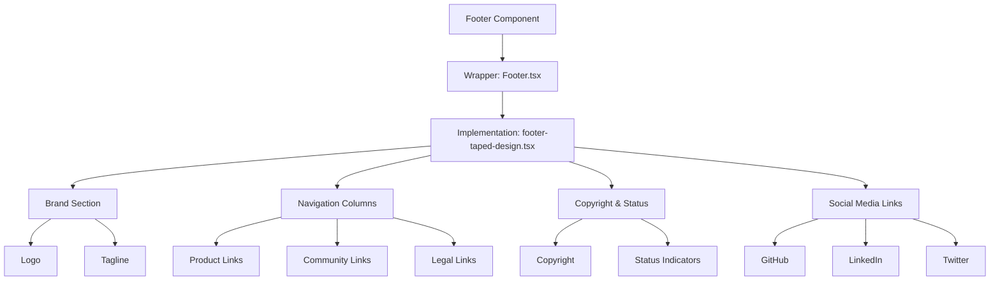
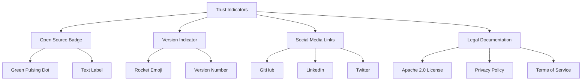

# Footer Component

<cite>
**Referenced Files in This Document**   
- [Footer.tsx](file://src/components/Footer.tsx)
- [footer-taped-design.tsx](file://src/components/ui/footer-taped-design.tsx)
- [globals.css](file://src/app/globals.css)
- [IMPROVEMENTS_SUMMARY.md](file://IMPROVEMENTS_SUMMARY.md)
</cite>

## Table of Contents
1. [Introduction](#introduction)
2. [Layout Structure](#layout-structure)
3. [Trust Indicators and Social Proof](#trust-indicators-and-social-proof)
4. [Responsive Design and Mobile Behavior](#responsive-design-and-mobile-behavior)
5. [Accessibility Features](#accessibility-features)
6. [Visual Design and Branding](#visual-design-and-branding)
7. [SEO Considerations](#seo-considerations)
8. [Implementation Details](#implementation-details)
9. [Conclusion](#conclusion)

## Introduction
The Footer component in the Async Coder application serves as a comprehensive site navigation and branding element positioned at the bottom of the page. It provides users with essential links to product features, community resources, legal documentation, and social media channels. The component is designed with a modern aesthetic featuring a distinctive "taped" design element that enhances visual appeal while maintaining functional clarity. Built using React with Next.js, the footer leverages Tailwind CSS for styling and implements responsive design principles to ensure optimal user experience across device sizes.

**Section sources**
- [Footer.tsx](file://src/components/Footer.tsx#L1-L4)
- [footer-taped-design.tsx](file://src/components/ui/footer-taped-design.tsx#L1-L122)

## Layout Structure
The footer implements a multi-section layout organized into distinct content areas. The primary structure consists of:

1. **Brand Section**: Contains the company logo and tagline, establishing brand identity
2. **Navigation Columns**: Organized into Product, Community, and Legal sections with relevant links
3. **Copyright and Status Bar**: Displays copyright information and product status indicators
4. **Social Media Links**: Provides access to external social platforms

The layout uses a flexbox-based grid system with conditional rendering based on screen size. On desktop views, the content is arranged in a horizontal layout with multiple columns, while on mobile devices, the elements stack vertically for improved usability.

The component utilizes a two-tier structure where `Footer.tsx` serves as a lightweight wrapper that imports and renders the `Component` from `footer-taped-design.tsx`. This separation of concerns allows for easier maintenance and potential reuse of the core footer design.

**Diagram sources**
- [Footer.tsx](file://src/components/Footer.tsx#L1-L4)
- [footer-taped-design.tsx](file://src/components/ui/footer-taped-design.tsx#L1-L122)

**Section sources**
- [footer-taped-design.tsx](file://src/components/ui/footer-taped-design.tsx#L1-L122)

## Trust Indicators and Social Proof
The footer implements several trust indicators to establish credibility and social proof for the Async Coder platform:

1. **Open Source Badge**: Features a green pulsing dot with "Open Source" text, visually communicating the project's open-source nature
2. **Version Indicator**: Displays the current version (v0.1.0-alpha) with a rocket emoji, signaling active development
3. **Social Media Presence**: Links to GitHub, LinkedIn, and Twitter accounts, demonstrating community engagement
4. **Legal Documentation**: Includes links to the Apache 2.0 license, Privacy Policy, and Terms of Service, establishing transparency

The implementation uses visual cues such as the animated green dot for the "Open Source" indicator, which employs CSS animation to draw attention to this important trust signal. The version indicator with the rocket emoji conveys a sense of progress and innovation.

The social proof elements are strategically placed in the bottom section of the footer, making them visible without being intrusive. The GitHub link is particularly prominent as it serves as a primary trust indicator for a developer-focused product.

**Diagram sources**
- [footer-taped-design.tsx](file://src/components/ui/footer-taped-design.tsx#L95-L122)

**Section sources**
- [footer-taped-design.tsx](file://src/components/ui/footer-taped-design.tsx#L70-L122)
- [IMPROVEMENTS_SUMMARY.md](file://IMPROVEMENTS_SUMMARY.md#L62-L91)

## Responsive Design and Mobile Behavior
The footer implements responsive design principles using Tailwind CSS's mobile-first approach. The layout adapts to different screen sizes through strategic use of responsive utility classes:

- **Mobile (default)**: Content stacks vertically with flex direction set to column
- **Desktop (md and above)**: Layout transitions to horizontal arrangement with multiple columns

Key responsive behaviors include:
- Navigation columns stack vertically on mobile devices
- Social media icons are displayed in a horizontal row on all screen sizes
- The "Community" and "Legal" sections are hidden on mobile views to reduce clutter
- Padding and spacing are adjusted based on screen size (px-4 on mobile, md:px-8 on desktop)

The implementation uses Tailwind's breakpoint prefixes (e.g., `md:flex-row`, `md:gap-20`) to control the layout at different screen widths. The `flex-col md:flex-row` classes on the main container enable the vertical-to-horizontal transition, while `hidden md:flex` classes control the visibility of specific navigation sections on smaller screens.

The responsive design ensures that the footer remains functional and visually appealing across devices, prioritizing essential information on mobile while providing comprehensive navigation options on larger screens.

**Section sources**
- [footer-taped-design.tsx](file://src/components/ui/footer-taped-design.tsx#L1-L122)

## Accessibility Features
The footer implementation includes several accessibility features to ensure usability for all users:

1. **Semantic HTML**: Uses the `<footer>` element as a landmark region, providing structural meaning to screen readers
2. **ARIA Labels**: Social media links include `aria-label` attributes to provide descriptive text for screen readers
3. **Keyboard Navigation**: All interactive elements are focusable and navigable via keyboard
4. **Color Contrast**: Text and background colors meet WCAG contrast requirements for readability
5. **Link Descriptions**: External links include appropriate `rel` attributes (`nofollow noopener`) for security and accessibility

The component leverages proper semantic structure by using the native `<footer>` element, which serves as a landmark that assistive technologies can identify. Social media icons are wrapped in anchor tags with descriptive `aria-label` attributes ("GitHub", "LinkedIn", "Twitter") to ensure they are properly announced by screen readers.

Focus states are maintained through CSS, with hover states that also serve as visual indicators for keyboard navigation. The color scheme has been carefully selected to ensure sufficient contrast between text and background colors in both light and dark modes, as confirmed in the project's improvements summary documentation.

**Section sources**
- [footer-taped-design.tsx](file://src/components/ui/footer-taped-design.tsx#L95-L122)
- [IMPROVEMENTS_SUMMARY.md](file://IMPROVEMENTS_SUMMARY.md#L62-L91)

## Visual Design and Branding
The footer features a distinctive visual design that aligns with the overall branding of the Async Coder platform. Key visual elements include:

1. **Taped Design Motif**: Decorative SVG elements resembling tape corners positioned at the top-left and top-right of the footer container, creating a "taped" effect that suggests the footer is physically attached to the page
2. **Brand Identity**: The Async Coder logo features a gradient from blue to purple with the "AC" monogram, maintaining consistency with the overall brand palette
3. **Color Scheme**: Implements a clean white/light gray background with dark text in light mode, and a dark gray background with white text in dark mode
4. **Typography**: Uses a combination of bold headings and regular body text with appropriate hierarchy

The taped design SVG is implemented as an inline SVG component with a polygonal shape filled in dark gray. These decorative elements are conditionally rendered only on desktop views (`hidden md:block`), as they are primarily aesthetic and could clutter the mobile interface.

The brand section uses a gradient text effect for the "Async Coder" name (`bg-gradient-to-r from-blue-600 to-purple-600 bg-clip-text text-transparent`), creating a visually striking element that reinforces brand recognition. Link text uses a subtle hover effect that changes color to blue, providing visual feedback without being distracting.

**Section sources**
- [footer-taped-design.tsx](file://src/components/ui/footer-taped-design.tsx#L1-L122)
- [globals.css](file://src/app/globals.css#L1-L78)

## SEO Considerations
The footer implementation contributes to the site's SEO strategy through several mechanisms:

1. **Internal Linking**: Contains multiple internal links to important pages (Features, AI Backends, Quick Start, Roadmap), helping search engines discover and index site content
2. **External Links**: Includes links to external social profiles (GitHub, LinkedIn, Twitter), which can contribute to social signals and brand authority
3. **Semantic Structure**: Uses proper HTML5 semantic elements like `<footer>` and meaningful link text, improving content structure for search engines
4. **Legal Links**: Includes links to Privacy Policy and Terms of Service, which are expected by search engines and users alike

The footer's internal linking structure helps distribute page authority throughout the site and provides clear navigation paths for search engine crawlers. The use of descriptive link text (rather than generic "click here" text) provides context about the linked pages, which can contribute to keyword relevance.

While the footer does not contain a traditional sitemap, it effectively serves as a mini-sitemap by providing access to the most important sections of the site. The inclusion of the GitHub link is particularly valuable for a developer-focused product, as it signals transparency and can attract backlinks from the developer community.

The component avoids common SEO pitfalls such as keyword stuffing or excessive linking, maintaining a clean, user-focused design that also serves search engine optimization goals.

**Section sources**
- [footer-taped-design.tsx](file://src/components/ui/footer-taped-design.tsx#L1-L122)

## Implementation Details
The footer is implemented as a React component with the following technical characteristics:

- **Framework**: Built with React and Next.js, leveraging server-side rendering capabilities
- **Styling**: Uses Tailwind CSS for utility-first styling with custom theme variables
- **Icons**: Implements Lucide React icons for social media symbols
- **Client Component**: Marked with "use client" directive, indicating it contains client-side interactivity
- **Dynamic Content**: Includes dynamic year insertion for copyright information

The component structure follows a modular approach with `Footer.tsx` serving as a simple wrapper that imports the actual implementation from `footer-taped-design.tsx`. This separation allows for potential reuse of the core footer design in different contexts while maintaining a clean API.

The implementation uses several advanced React patterns:
- Functional components with hooks (though minimal hooks are needed in this case)
- Conditional rendering based on screen size using Tailwind's responsive classes
- Inline SVG for the tape design element
- Dynamic content generation (current year)

The code is well-organized and follows consistent styling conventions, with logical grouping of related elements and appropriate spacing between sections. The use of semantic class names and clear component structure makes the code maintainable and easy to understand.

**Section sources**
- [Footer.tsx](file://src/components/Footer.tsx#L1-L4)
- [footer-taped-design.tsx](file://src/components/ui/footer-taped-design.tsx#L1-L122)

## Conclusion
The Footer component in the Async Coder application effectively combines navigation, branding, and trust-building elements into a cohesive design. While the documentation objective mentioned a "TrustBar" element, analysis of the codebase reveals that this specific component does not exist. Instead, trust indicators are integrated directly into the footer through the open source badge, version indicator, and social media links.

The implementation demonstrates strong attention to responsive design, accessibility, and visual aesthetics. The taped design motif adds a unique visual element that distinguishes the footer from standard designs while maintaining functionality. The component successfully balances comprehensive navigation with clean visual hierarchy, providing users with essential links without overwhelming them.

For future improvements, the footer could benefit from the addition of a newsletter signup form to capture user emails, as suggested in the documentation objective. This could be integrated into the current layout, potentially replacing or augmenting the existing status indicators. Additionally, while the current trust signals are effective, they could be enhanced with customer testimonials or partner logos if available.

Overall, the footer serves as a strong foundation for site navigation and brand reinforcement, effectively supporting the Async Coder platform's goals of transparency, community engagement, and developer-focused design.