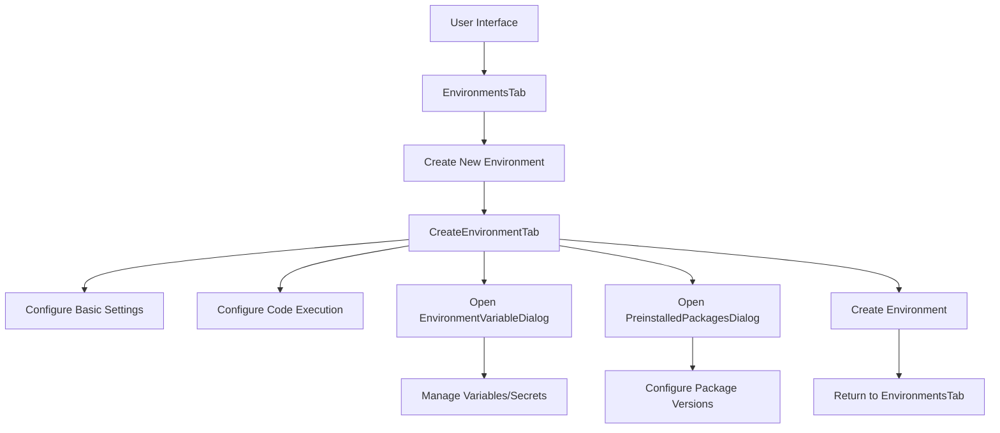
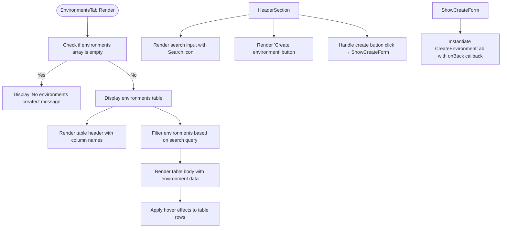
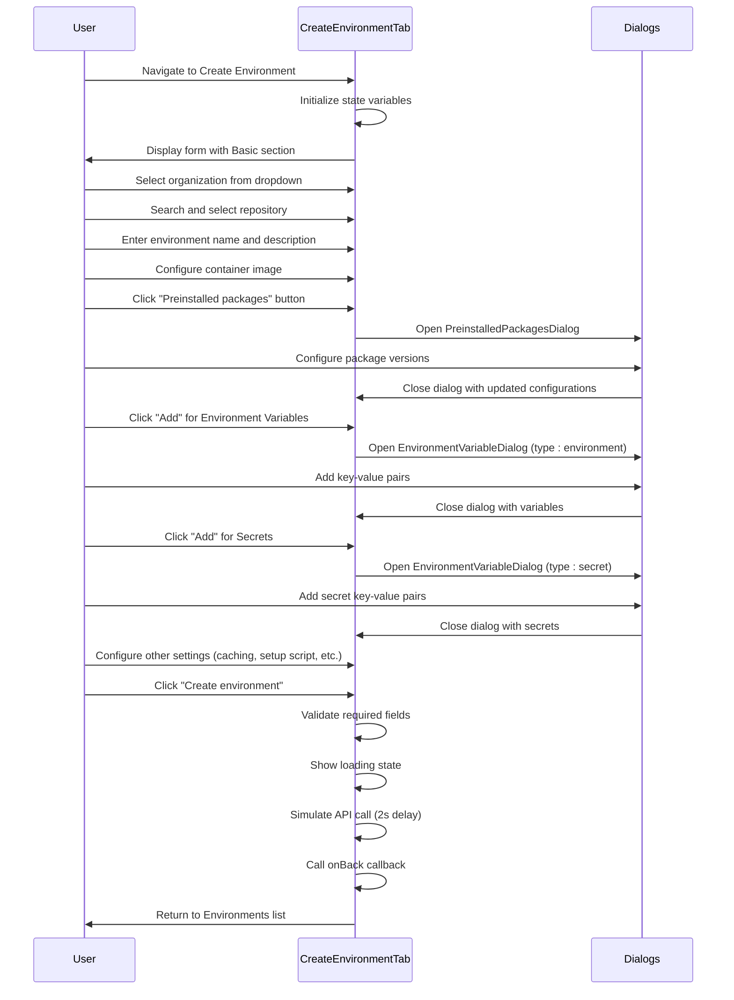

# Environment Management System

<cite>
**Referenced Files in This Document**   
- [EnvironmentsTab.tsx](file://src/components/settings/tabs/EnvironmentsTab.tsx)
- [CreateEnvironmentTab.tsx](file://src/components/settings/tabs/CreateEnvironmentTab.tsx)
- [EnvironmentVariableDialog.tsx](file://src/components/settings/dialogs/EnvironmentVariableDialog.tsx)
- [PreinstalledPackagesDialog.tsx](file://src/components/settings/dialogs/PreinstalledPackagesDialog.tsx)
</cite>

## Table of Contents
1. [Introduction](#introduction)
2. [Project Structure](#project-structure)
3. [Core Components](#core-components)
4. [Architecture Overview](#architecture-overview)
5. [Detailed Component Analysis](#detailed-component-analysis)
6. [Dependency Analysis](#dependency-analysis)
7. [Performance Considerations](#performance-considerations)
8. [Troubleshooting Guide](#troubleshooting-guide)
9. [Conclusion](#conclusion)

## Introduction
The Environment Management System is a comprehensive solution for managing development environments within the Async Coder platform. It enables users to create, configure, and manage isolated coding environments linked to GitHub repositories. The system supports environment variables, secrets, preinstalled packages, and container configurations, providing a robust foundation for consistent and reproducible development workflows. This documentation details the system's architecture, functionality, and usage patterns.

## Project Structure
The Environment Management System is organized within the Next.js application structure, following a component-based architecture. Key components are located in the settings section of the application, with dedicated tabs and dialog components for environment management functionality.

```mermaid
graph TB
subgraph "Settings Components"
EnvironmentsTab[EnvironmentsTab.tsx]
CreateEnvironmentTab[CreateEnvironmentTab.tsx]
subgraph "Dialogs"
EnvironmentVariableDialog[EnvironmentVariableDialog.tsx]
PreinstalledPackagesDialog[PreinstalledPackagesDialog.tsx]
end
end
EnvironmentsTab --> CreateEnvironmentTab : "navigation"
CreateEnvironmentTab --> EnvironmentVariableDialog : "opens"
CreateEnvironmentTab --> PreinstalledPackagesDialog : "opens"
```

**Diagram sources**
- [EnvironmentsTab.tsx](file://src/components/settings/tabs/EnvironmentsTab.tsx)
- [CreateEnvironmentTab.tsx](file://src/components/settings/tabs/CreateEnvironmentTab.tsx)
- [EnvironmentVariableDialog.tsx](file://src/components/settings/dialogs/EnvironmentVariableDialog.tsx)
- [PreinstalledPackagesDialog.tsx](file://src/components/settings/dialogs/PreinstalledPackagesDialog.tsx)

**Section sources**
- [EnvironmentsTab.tsx](file://src/components/settings/tabs/EnvironmentsTab.tsx)
- [CreateEnvironmentTab.tsx](file://src/components/settings/tabs/CreateEnvironmentTab.tsx)

## Core Components
The Environment Management System consists of four primary components that work together to provide a complete environment configuration experience. The EnvironmentsTab displays a list of existing environments and provides access to create new ones. The CreateEnvironmentTab guides users through the environment creation process with a comprehensive form. The EnvironmentVariableDialog manages both environment variables and secrets through a unified interface. The PreinstalledPackagesDialog allows configuration of preinstalled packages and their versions.

**Section sources**
- [EnvironmentsTab.tsx](file://src/components/settings/tabs/EnvironmentsTab.tsx)
- [CreateEnvironmentTab.tsx](file://src/components/settings/tabs/CreateEnvironmentTab.tsx)
- [EnvironmentVariableDialog.tsx](file://src/components/settings/dialogs/EnvironmentVariableDialog.tsx)
- [PreinstalledPackagesDialog.tsx](file://src/components/settings/dialogs/PreinstalledPackagesDialog.tsx)

## Architecture Overview
The Environment Management System follows a client-side component architecture with React and Next.js. The system is organized around a tab-based navigation pattern within the settings interface, with the EnvironmentsTab serving as the entry point. When users initiate environment creation, they are navigated to the CreateEnvironmentTab, which contains a multi-section form for configuring all environment aspects. Modal dialogs are used for complex configuration tasks, maintaining focus on the primary creation workflow.



**Diagram sources**
- [EnvironmentsTab.tsx](file://src/components/settings/tabs/EnvironmentsTab.tsx#L0-L117)
- [CreateEnvironmentTab.tsx](file://src/components/settings/tabs/CreateEnvironmentTab.tsx#L0-L441)

## Detailed Component Analysis

### EnvironmentsTab Analysis
The EnvironmentsTab component serves as the main interface for viewing and managing existing environments. It displays environments in a tabular format with columns for name, repository, task count, creator, and creation date. The component includes search functionality to filter environments and a button to initiate the creation of new environments. When no environments exist, it displays an empty state message.



**Diagram sources**
- [EnvironmentsTab.tsx](file://src/components/settings/tabs/EnvironmentsTab.tsx#L0-L117)

**Section sources**
- [EnvironmentsTab.tsx](file://src/components/settings/tabs/EnvironmentsTab.tsx#L0-L117)

### CreateEnvironmentTab Analysis
The CreateEnvironmentTab component provides a comprehensive form for creating new development environments. It is organized into two main columns: a form section on the left and a terminal preview on the right. The form is divided into "Basic" and "Code execution" sections, covering all configuration aspects. The component manages state for organization selection, repository selection, environment naming, description, container configuration, and advanced settings.



**Diagram sources**
- [CreateEnvironmentTab.tsx](file://src/components/settings/tabs/CreateEnvironmentTab.tsx#L0-L441)

**Section sources**
- [CreateEnvironmentTab.tsx](file://src/components/settings/tabs/CreateEnvironmentTab.tsx#L0-L441)

### EnvironmentVariableDialog Analysis
The EnvironmentVariableDialog component provides a modal interface for managing environment variables and secrets. It supports multiple key-value pairs with the ability to add, edit, and remove entries. The component uses different input types for variables (text) and secrets (password), providing appropriate security measures. The dialog is reusable for both environment variables and secrets through the "type" prop.

```mermaid
classDiagram
class EnvironmentVariableDialog {
+open : boolean
+onOpenChange : (open : boolean) => void
+title : string
+type : 'environment' | 'secret'
-variables : Variable[]
-addVariable() : void
-removeVariable(id : string) : void
-updateVariable(id : string, field : 'key' | 'value', value : string) : void
}
class Variable {
+id : string
+key : string
+value : string
}
EnvironmentVariableDialog --> Variable : "contains"
note right of EnvironmentVariableDialog
Reusable dialog for both environment variables
and secrets. When type is 'secret', input
fields use password type for value.
end note
```

**Diagram sources**
- [EnvironmentVariableDialog.tsx](file://src/components/settings/dialogs/EnvironmentVariableDialog.tsx#L0-L131)

**Section sources**
- [EnvironmentVariableDialog.tsx](file://src/components/settings/dialogs/EnvironmentVariableDialog.tsx#L0-L131)

### PreinstalledPackagesDialog Analysis
The PreinstalledPackagesDialog component allows users to configure versions for preinstalled packages in the development environment. It displays a list of supported packages with their icons and color coding. Each package has a dropdown selector for choosing the version. The component maintains state for package versions and updates them when users make selections.

```mermaid
classDiagram
class PreinstalledPackagesDialog {
+open : boolean
+onOpenChange : (open : boolean) => void
-packageVersions : Record<string, string>
-updatePackageVersion(packageName : string, version : string) : void
}
class PackageConfig {
+name : string
+icon : string
+color : string
+defaultVersion : string
+versions : string[]
}
PreinstalledPackagesDialog --> PackageConfig : "contains"
note right of PreinstalledPackagesDialog
Supports 9 programming languages/frameworks :
Python, Node.js, Ruby, Rust, Go, Bun, PHP,
Java, and Swift. Each has multiple version
options available.
end note
```

**Diagram sources**
- [PreinstalledPackagesDialog.tsx](file://src/components/settings/dialogs/PreinstalledPackagesDialog.tsx#L0-L158)

**Section sources**
- [PreinstalledPackagesDialog.tsx](file://src/components/settings/dialogs/PreinstalledPackagesDialog.tsx#L0-L158)

## Dependency Analysis
The Environment Management System components have a clear dependency hierarchy. The EnvironmentsTab depends on the CreateEnvironmentTab for creating new environments. The CreateEnvironmentTab depends on both the EnvironmentVariableDialog and PreinstalledPackagesDialog for advanced configuration. These dialog components are independent and can be reused across different parts of the application.

```mermaid
graph TD
EnvironmentsTab --> CreateEnvironmentTab
CreateEnvironmentTab --> EnvironmentVariableDialog
CreateEnvironmentTab --> PreinstalledPackagesDialog
EnvironmentVariableDialog --> UIComponents["UI Components (Dialog, Input, Button)"]
PreinstalledPackagesDialog --> UIComponents
CreateEnvironmentTab --> UIComponents
EnvironmentsTab --> UIComponents
note right of EnvironmentsTab
Main entry point for environment
management
end note
note right of CreateEnvironmentTab
Central component that orchestrates
environment creation workflow
end note
note right of EnvironmentVariableDialog
Reusable component for key-value
configuration
end note
note right of PreinstalledPackagesDialog
Specialized for package version
configuration
end note
```

**Diagram sources**
- [EnvironmentsTab.tsx](file://src/components/settings/tabs/EnvironmentsTab.tsx)
- [CreateEnvironmentTab.tsx](file://src/components/settings/tabs/CreateEnvironmentTab.tsx)
- [EnvironmentVariableDialog.tsx](file://src/components/settings/dialogs/EnvironmentVariableDialog.tsx)
- [PreinstalledPackagesDialog.tsx](file://src/components/settings/dialogs/PreinstalledPackagesDialog.tsx)

**Section sources**
- [EnvironmentsTab.tsx](file://src/components/settings/tabs/EnvironmentsTab.tsx)
- [CreateEnvironmentTab.tsx](file://src/components/settings/tabs/CreateEnvironmentTab.tsx)
- [EnvironmentVariableDialog.tsx](file://src/components/settings/dialogs/EnvironmentVariableDialog.tsx)
- [PreinstalledPackagesDialog.tsx](file://src/components/settings/dialogs/PreinstalledPackagesDialog.tsx)

## Performance Considerations
The Environment Management System is designed with performance in mind. The components use React's useState hook for local state management, minimizing re-renders through proper state organization. The search functionality in the repository selection implements immediate filtering without API calls, providing instant feedback. The modal dialogs are conditionally rendered only when needed, reducing initial page load complexity. The terminal preview provides visual feedback without requiring actual terminal connections during the configuration phase.

## Troubleshooting Guide
Common issues with the Environment Management System typically relate to form validation and state management. If the "Create environment" button remains disabled, ensure that organization, repository, and environment name fields are properly filled. If dialog components fail to open, verify that the corresponding state variables (showPackagesDialog, showEnvDialog, showSecretsDialog) are correctly managed. For search functionality issues in the repository list, check that the filteredRepos computation is properly filtering the repositories array based on the searchRepo state. If environment variables or secrets are not persisting, ensure that the state update functions (updateVariable) are correctly implemented and called with the proper parameters.

**Section sources**
- [CreateEnvironmentTab.tsx](file://src/components/settings/tabs/CreateEnvironmentTab.tsx#L28-L55)
- [EnvironmentVariableDialog.tsx](file://src/components/settings/dialogs/EnvironmentVariableDialog.tsx#L25-L35)

## Conclusion
The Environment Management System provides a comprehensive solution for creating and managing development environments within the Async Coder platform. Through a well-structured component hierarchy and intuitive user interface, it enables developers to configure environments with precise control over dependencies, variables, and execution settings. The system's modular design with reusable dialog components promotes consistency and maintainability. By following the patterns and practices documented here, users can effectively leverage the system to create reproducible development environments that enhance productivity and collaboration.