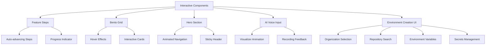
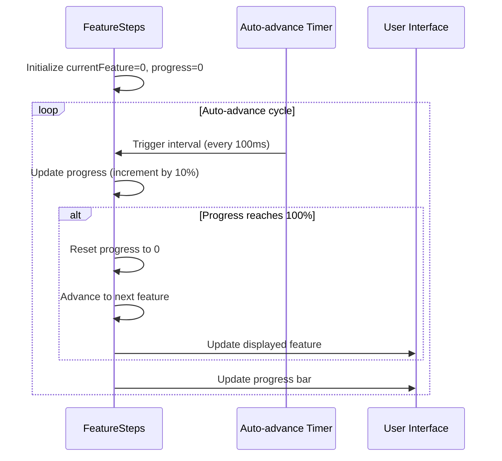
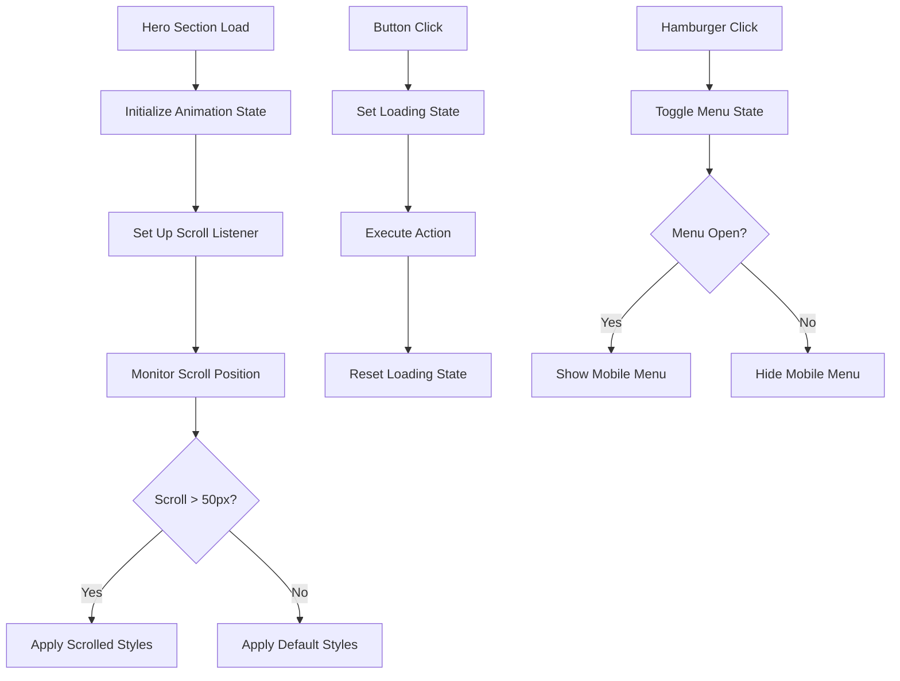
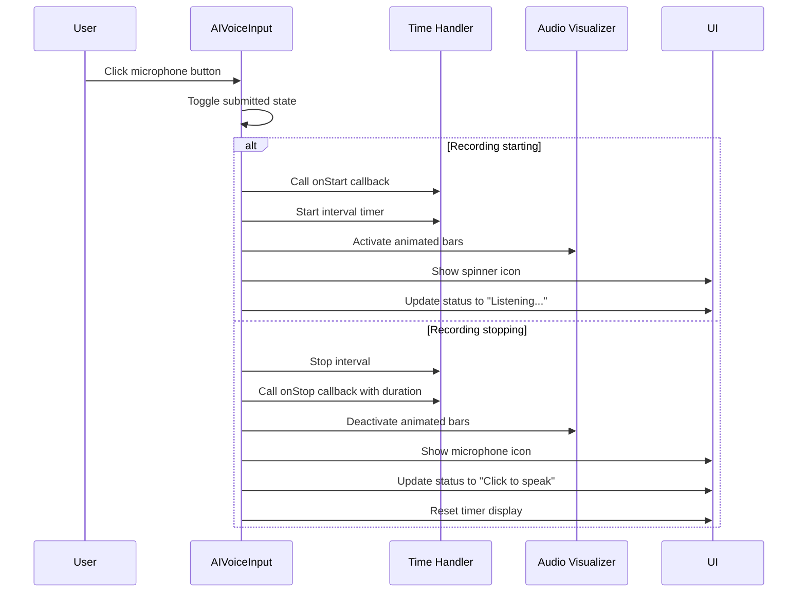
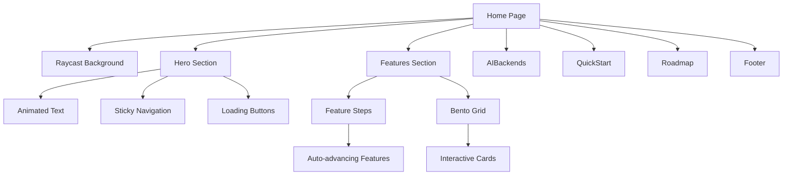
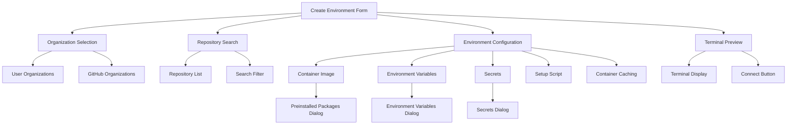

# Interactive Features

<cite>
**Referenced Files in This Document**   
- [feature-section.tsx](file://src/components/ui/feature-section.tsx)
- [bento-demo.tsx](file://src/components/ui/bento-demo.tsx)
- [bento-grid.tsx](file://src/components/ui/bento-grid.tsx)
- [hero-section-1.tsx](file://src/components/ui/hero-section-1.tsx)
- [ai-voice-input.tsx](file://src/components/ui/ai-voice-input.tsx)
- [ai-voice-input-demo.tsx](file://src/components/ui/ai-voice-input-demo.tsx)
- [Features.tsx](file://src/components/Features.tsx)
- [page.tsx](file://src/app/page.tsx)
- [CreateEnvironmentTab.tsx](file://src/components/settings/tabs/CreateEnvironmentTab.tsx) - *Added in recent commit*
- [EnvironmentVariableDialog.tsx](file://src/components/settings/dialogs/EnvironmentVariableDialog.tsx) - *Added in recent commit*
- [PreinstalledPackagesDialog.tsx](file://src/components/settings/dialogs/PreinstalledPackagesDialog.tsx) - *Added in recent commit*
</cite>

## Update Summary
**Changes Made**   
- Added new section for Environment Creation UI
- Updated Table of Contents to include new section
- Added references to new files in document sources
- Enhanced source tracking for new interactive components
- Added new diagram for environment creation workflow

## Table of Contents
1. [Introduction](#introduction)
2. [Interactive UI Components Overview](#interactive-ui-components-overview)
3. [Feature Steps Component](#feature-steps-component)
4. [Bento Grid Implementation](#bento-grid-implementation)
5. [Hero Section Interactivity](#hero-section-interactivity)
6. [AI Voice Input Component](#ai-voice-input-component)
7. [Component Integration](#component-integration)
8. [Environment Creation UI](#environment-creation-ui)

## Introduction
This document provides a comprehensive analysis of the interactive features implemented in the Async Coder application. The system incorporates various interactive UI components that enhance user engagement through animations, transitions, and responsive interactions. These features are built using React, Framer Motion, and Tailwind CSS, creating a dynamic user experience that guides users through the platform's capabilities.

The interactive components serve both aesthetic and functional purposes, providing visual feedback, demonstrating product capabilities, and improving overall usability. This documentation details the implementation, functionality, and integration of these interactive elements across the application.

## Interactive UI Components Overview
The Async Coder application implements several interactive components that create an engaging user experience. These components leverage React's state management, Framer Motion for animations, and Tailwind CSS for responsive styling. The primary interactive components include:

- **Feature Steps**: A step-by-step interactive guide that automatically cycles through features
- **Bento Grid**: An interactive grid layout showcasing different AI modes with hover effects
- **Hero Section**: A dynamic header with animated elements and interactive navigation
- **AI Voice Input**: A visual voice recording interface with real-time feedback
- **Environment Creation UI**: Interactive forms for creating development environments with organization and repository selection

These components work together to create a cohesive interactive experience that demonstrates the platform's capabilities while maintaining usability and accessibility.



**Diagram sources**
- [feature-section.tsx](file://src/components/ui/feature-section.tsx#L1-L123)
- [bento-demo.tsx](file://src/components/ui/bento-demo.tsx#L1-L115)
- [hero-section-1.tsx](file://src/components/ui/hero-section-1.tsx#L1-L296)
- [ai-voice-input.tsx](file://src/components/ui/ai-voice-input.tsx#L1-L147)
- [CreateEnvironmentTab.tsx](file://src/components/settings/tabs/CreateEnvironmentTab.tsx#L1-L442)

**Section sources**
- [feature-section.tsx](file://src/components/ui/feature-section.tsx#L1-L123)
- [bento-demo.tsx](file://src/components/ui/bento-demo.tsx#L1-L115)
- [hero-section-1.tsx](file://src/components/ui/hero-section-1.tsx#L1-L296)
- [ai-voice-input.tsx](file://src/components/ui/ai-voice-input.tsx#L1-L147)
- [CreateEnvironmentTab.tsx](file://src/components/settings/tabs/CreateEnvironmentTab.tsx#L1-L442)

## Feature Steps Component
The Feature Steps component provides an interactive, auto-advancing feature showcase that guides users through the application's capabilities. Implemented in `feature-section.tsx`, this component displays a series of features with synchronized content and visual elements.

The component uses React's useState and useEffect hooks to manage the current feature index and progress indicator. It automatically advances through features at a configurable interval (default: 3000ms), providing a hands-free demonstration of the platform's capabilities.



**Diagram sources**
- [feature-section.tsx](file://src/components/ui/feature-section.tsx#L15-L50)

**Section sources**
- [feature-section.tsx](file://src/components/ui/feature-section.tsx#L1-L123)

### Key Implementation Details
The component implements several interactive features:

1. **Auto-advancing carousel**: Uses setInterval to automatically cycle through features
2. **Visual progress indicator**: Shows advancement toward the next feature
3. **Synchronized content and imagery**: Text content and images change together
4. **Step indicators**: Visual markers showing completed, current, and upcoming steps
5. **Responsive design**: Adapts layout for mobile and desktop views

The component accepts the following props:
- `features`: Array of feature objects containing step, title, content, and image
- `className`: Custom CSS classes for styling
- `title`: Section title (default: "How to get Started")
- `autoPlayInterval`: Time between feature changes in milliseconds (default: 3000)

## Bento Grid Implementation
The Bento Grid component, implemented across `bento-grid.tsx` and `bento-demo.tsx`, creates an interactive grid layout that showcases the platform's AI modes. This component uses a responsive 3-column grid that reorganizes on different screen sizes.

The grid features interactive cards that respond to hover events with smooth animations and visual feedback. Each card represents a different AI mode (Debug, Ask, Documentation, etc.) and includes an icon, title, description, and call-to-action button.

```mermaid
classDiagram
class BentoGrid {
+children : ReactNode
+className? : string
+render() : JSX.Element
}
class BentoCard {
+name : string
+className : string
+background : ReactNode
+Icon : React.ComponentType
+description : string
+href : string
+cta : string
+render() : JSX.Element
}
BentoGrid --> BentoCard : "contains multiple"
BentoCard --> "background" : "includes gradient and image"
BentoCard --> "hover effects" : "transform and opacity changes"
```

**Diagram sources**
- [bento-grid.tsx](file://src/components/ui/bento-grid.tsx#L1-L80)
- [bento-demo.tsx](file://src/components/ui/bento-demo.tsx#L1-L115)

**Section sources**
- [bento-grid.tsx](file://src/components/ui/bento-grid.tsx#L1-L80)
- [bento-demo.tsx](file://src/components/ui/bento-demo.tsx#L1-L115)

### Interactive Features
The Bento Grid implements several interactive elements:

1. **Hover effects**: Cards scale down slightly and reveal a call-to-action button
2. **Background gradients**: Each card has a unique color scheme matching its AI mode
3. **Responsive layout**: Grid reorganizes from 3 columns to stacked layout on mobile
4. **Visual hierarchy**: Important cards can span multiple rows or columns
5. **Interactive backgrounds**: Subtle background images with overlay gradients

The component structure consists of:
- **BentoGrid**: Container component that defines the grid layout
- **BentoCard**: Individual card component with interactive elements
- **Feature configuration**: Array of feature objects defining card content

## Hero Section Interactivity
The Hero Section, implemented in `hero-section-1.tsx`, contains multiple interactive elements that create an engaging first impression. This component serves as the main landing page header and includes animated elements, navigation, and call-to-action buttons.

The hero section implements several interactive features:
- **Animated text and elements**: Uses Framer Motion for smooth entrance animations
- **Sticky navigation**: Header becomes semi-transparent when scrolling
- **Interactive buttons**: Loading states and hover effects
- **Mobile-responsive menu**: Hamburger menu for mobile navigation
- **User authentication integration**: Conditional rendering based on login state



**Diagram sources**
- [hero-section-1.tsx](file://src/components/ui/hero-section-1.tsx#L1-L296)

**Section sources**
- [hero-section-1.tsx](file://src/components/ui/hero-section-1.tsx#L1-L296)

### Key Interactive Elements
The hero section includes several interactive components:

1. **AnimatedGroup**: Wrapper component that sequences animations for child elements
2. **LoadingButton**: Button component with loading states and animations
3. **Sticky header**: Navigation that changes appearance on scroll
4. **Hamburger menu**: Mobile navigation toggle with animation
5. **Authentication integration**: Conditional rendering for signed-in users

The component uses React's useState and useEffect hooks to manage:
- Menu open/closed state
- Scroll position tracking
- Button loading states
- Animation sequencing

## AI Voice Input Component
The AI Voice Input component, implemented in `ai-voice-input.tsx` and `ai-voice-input-demo.tsx`, provides a visual interface for voice interaction. This component simulates a voice recording interface with real-time feedback and visual indicators.

The component features:
- **Microphone button**: Toggles recording state with visual feedback
- **Audio visualizer**: Animated bars that simulate sound input
- **Timer display**: Shows recording duration
- **Status text**: Indicates current state (Listening... or Click to speak)
- **Demo mode**: Simulates recording for demonstration purposes



**Diagram sources**
- [ai-voice-input.tsx](file://src/components/ui/ai-voice-input.tsx#L1-L147)
- [ai-voice-input-demo.tsx](file://src/components/ui/ai-voice-input-demo.tsx#L1-L25)

**Section sources**
- [ai-voice-input.tsx](file://src/components/ui/ai-voice-input.tsx#L1-L147)
- [ai-voice-input-demo.tsx](file://src/components/ui/ai-voice-input-demo.tsx#L1-L25)

### Implementation Details
The AI Voice Input component implements several interactive features:

1. **State management**: Uses useState to track recording state and duration
2. **Time tracking**: Uses setInterval to update the timer display
3. **Visual feedback**: Changes button icon and status text based on state
4. **Audio visualization**: Animated bars that simulate sound input
5. **Demo mode**: Simulates recording for presentation purposes
6. **Callback system**: Notifies parent components of recording start/stop

The component accepts the following props:
- `onStart`: Callback function triggered when recording starts
- `onStop`: Callback function triggered when recording stops, receives duration
- `visualizerBars`: Number of bars in the audio visualizer (default: 48)
- `demoMode`: Enables automatic recording simulation
- `demoInterval`: Duration of demo recording in milliseconds (default: 3000)
- `className`: Custom CSS classes for styling

## Component Integration
The interactive components are integrated throughout the application to create a cohesive user experience. The main page (`page.tsx`) combines multiple interactive components to present a comprehensive overview of the platform's capabilities.

The integration follows a structured approach:
1. **Hero Section**: First impression with animated elements and calls-to-action
2. **Features Section**: Detailed showcase of capabilities using the Feature Steps and Bento Grid components
3. **AI Backends**: Presentation of supported AI providers
4. **Quick Start**: Guidance for new users
5. **Roadmap**: Timeline of future features



**Diagram sources**
- [page.tsx](file://src/app/page.tsx#L1-L34)
- [Features.tsx](file://src/components/Features.tsx#L1-L69)

**Section sources**
- [page.tsx](file://src/app/page.tsx#L1-L34)
- [Features.tsx](file://src/components/Features.tsx#L1-L69)

### Integration Strategy
The components are integrated using the following pattern:

1. **Layout structure**: The main page uses a relative positioning system with z-index layers
2. **Background elements**: The Raycast animated background is positioned behind all content
3. **Content layers**: Interactive components are layered with appropriate z-index values
4. **Responsive design**: All components adapt to different screen sizes
5. **Performance optimization**: Animations are optimized to prevent jank

The integration ensures that interactive elements work together harmoniously, creating a seamless user experience that effectively communicates the platform's value proposition while maintaining usability and accessibility standards.

## Environment Creation UI
The Environment Creation UI, implemented in `CreateEnvironmentTab.tsx`, provides an interactive interface for setting up development environments with organization and repository selection. This component enables users to configure environment settings including container images, environment variables, secrets, and setup scripts.

The component features a two-column layout with a form on the left and a terminal preview on the right. It uses React's useState hook for managing form state and handles environment creation through an asynchronous process with loading states.



**Diagram sources**
- [CreateEnvironmentTab.tsx](file://src/components/settings/tabs/CreateEnvironmentTab.tsx#L1-L442)
- [PreinstalledPackagesDialog.tsx](file://src/components/settings/dialogs/PreinstalledPackagesDialog.tsx#L1-L159)
- [EnvironmentVariableDialog.tsx](file://src/components/settings/dialogs/EnvironmentVariableDialog.tsx#L1-L132)

**Section sources**
- [CreateEnvironmentTab.tsx](file://src/components/settings/tabs/CreateEnvironmentTab.tsx#L1-L442)
- [PreinstalledPackagesDialog.tsx](file://src/components/settings/dialogs/PreinstalledPackagesDialog.tsx#L1-L159)
- [EnvironmentVariableDialog.tsx](file://src/components/settings/dialogs/EnvironmentVariableDialog.tsx#L1-L132)

### Interactive Features
The Environment Creation UI implements several interactive elements:

1. **Organization Selection**: Dropdown for selecting GitHub organizations with user-specific options
2. **Repository Search**: Filterable list of repositories with visibility indicators
3. **Form Validation**: Real-time validation with disabled submit button until required fields are filled
4. **Interactive Dialogs**: Separate dialogs for managing preinstalled packages, environment variables, and secrets
5. **Terminal Preview**: Visual representation of the environment with connect button
6. **Loading States**: Visual feedback during environment creation process

The component structure consists of:
- **CreateEnvironmentTab**: Main container component with form layout
- **PreinstalledPackagesDialog**: Dialog for configuring package versions
- **EnvironmentVariableDialog**: Reusable dialog for managing key-value pairs (environment variables and secrets)
- **Form Controls**: Custom inputs, selects, and buttons with consistent styling

### Key Implementation Details
The Environment Creation UI implements the following features:

1. **State Management**: Uses useState hooks to manage form fields and dialog states
2. **Organization Integration**: Displays user's GitHub organizations and personal account
3. **Repository Filtering**: Real-time search filtering for repository selection
4. **Container Configuration**: Options for container image, caching, and setup scripts
5. **Security Management**: Separate sections for environment variables and secrets with appropriate masking
6. **Interactive Previews**: Terminal display showing the environment context
7. **Loading Feedback**: LoadingButton component shows progress during environment creation

The component accepts the following props:
- `onBack`: Callback function to navigate back to the environments list
- Form fields for environment configuration (name, description, repository, etc.)
- State variables for all configuration options
- Dialog state controllers for package, environment variable, and secret management