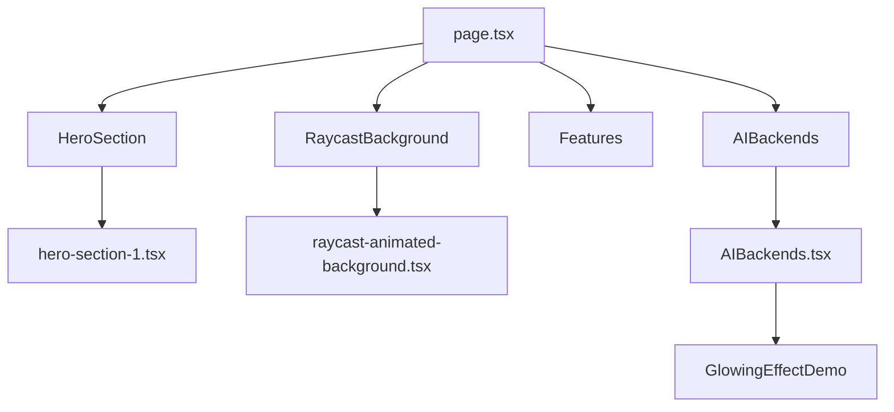
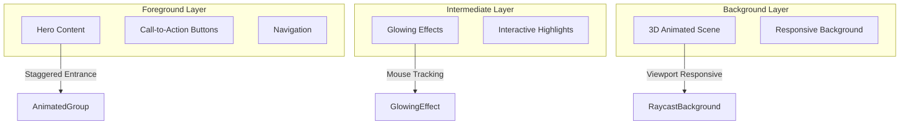
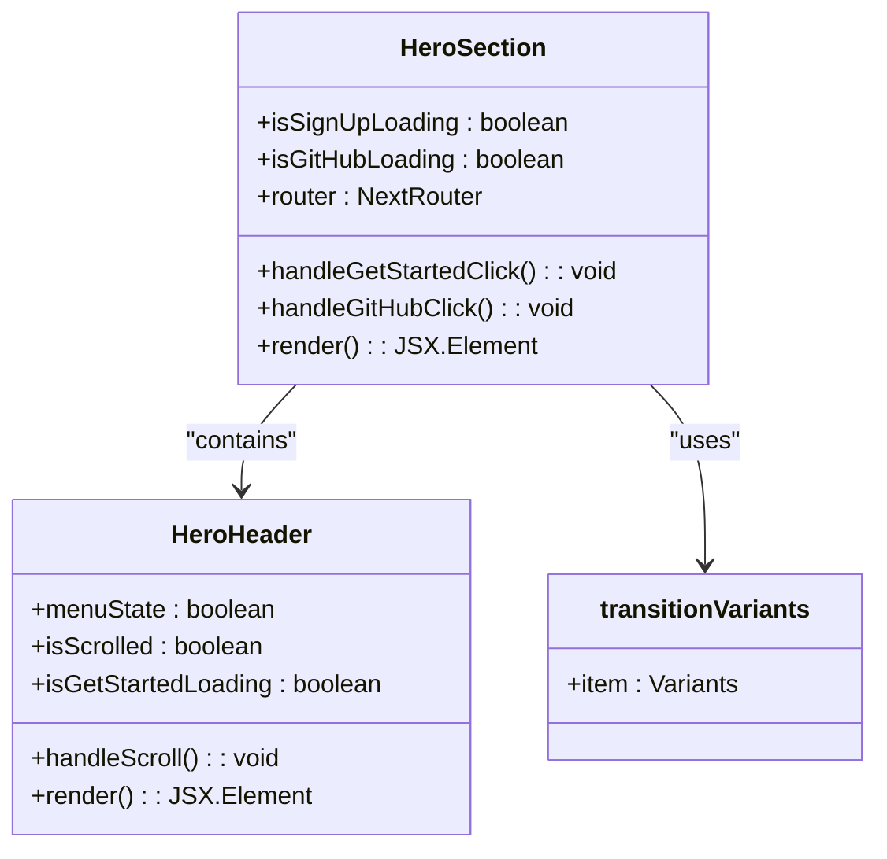
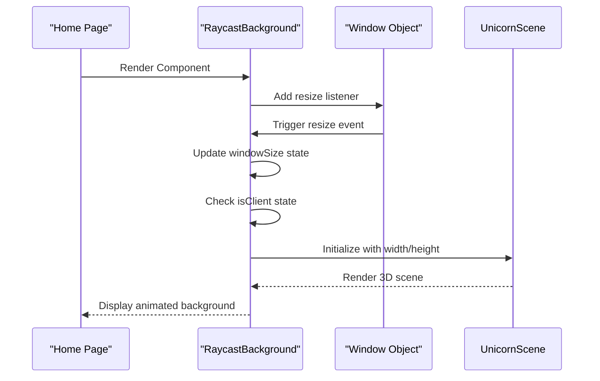
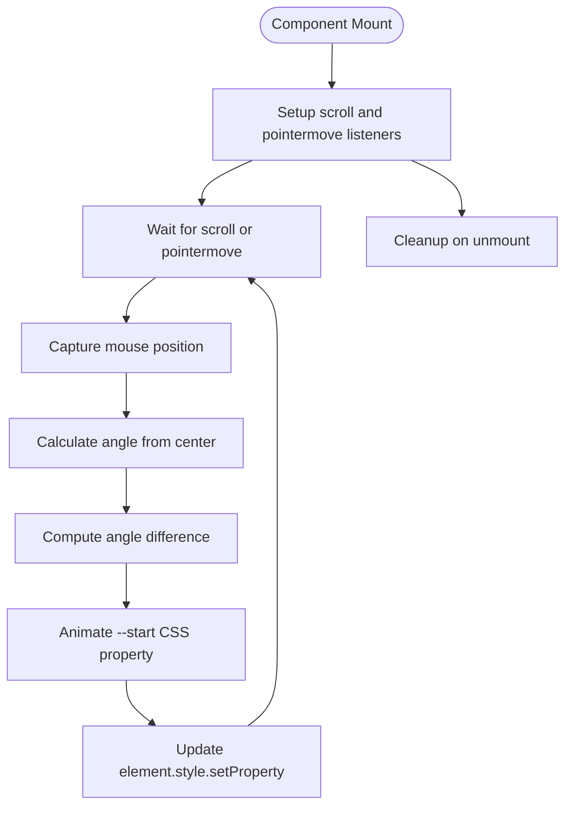
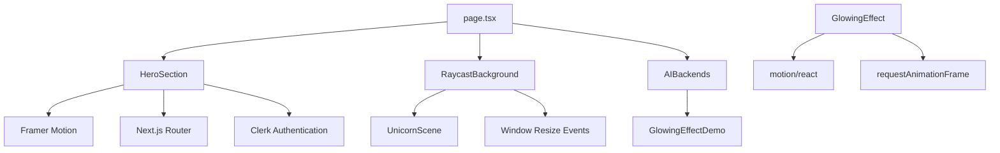

# Hero Section Interactivity

<cite>
**Referenced Files in This Document**   
- [hero-section-1.tsx](file://src/components/ui/hero-section-1.tsx)
- [raycast-animated-background.tsx](file://src/components/ui/raycast-animated-background.tsx)
- [glowing-effect.tsx](file://src/components/ui/glowing-effect.tsx)
- [page.tsx](file://src/app/page.tsx)
- [AIBackends.tsx](file://src/components/AIBackends.tsx)
</cite>

## Table of Contents
1. [Introduction](#introduction)
2. [Project Structure](#project-structure)
3. [Core Components](#core-components)
4. [Architecture Overview](#architecture-overview)
5. [Detailed Component Analysis](#detailed-component-analysis)
6. [Dependency Analysis](#dependency-analysis)
7. [Performance Considerations](#performance-considerations)
8. [Troubleshooting Guide](#troubleshooting-guide)
9. [Conclusion](#conclusion)

## Introduction
This document provides a comprehensive analysis of the interactive features within the HeroSection component of the Async Coder application. The focus is on understanding how 3D transformations and parallax effects are implemented using React, Framer Motion, and custom animation libraries. While the primary HeroSection component (`hero-section-1.tsx`) does not directly implement complex 3D mouse-tracking effects, these visual enhancements are achieved through complementary components such as `raycast-animated-background` and `glowing-effect`. These elements work in concert to create an immersive user experience with depth perception, dynamic lighting, and responsive animations driven by mouse movement and scroll events.

## Project Structure
The project follows a Next.js App Router architecture with a clear separation between UI components and higher-level page composition. The hero section functionality is distributed across multiple files in the `src/components/ui` directory, with the main hero content defined in `hero-section-1.tsx` and visual effects implemented in specialized components. The component hierarchy begins in `page.tsx`, which orchestrates the layout by combining the hero section with background effects and other page sections.

**Diagram sources**
- [page.tsx](file://src/app/page.tsx#L1-L35)
- [hero-section-1.tsx](file://src/components/ui/hero-section-1.tsx#L1-L295)
- [raycast-animated-background.tsx](file://src/components/ui/raycast-animated-background.tsx#L1-L56)
- [AIBackends.tsx](file://src/components/AIBackends.tsx#L1-L8)

**Section sources**
- [page.tsx](file://src/app/page.tsx#L1-L35)
- [hero-section-1.tsx](file://src/components/ui/hero-section-1.tsx#L1-L295)

## Core Components
The core interactive components analyzed in this document include:
- **HeroSection**: The main hero component that displays headline content, call-to-action buttons, and navigation
- **RaycastAnimatedBackground**: A 3D animated background powered by UnicornScene that creates depth and motion
- **GlowingEffect**: A mouse-responsive glowing effect that tracks cursor position and orientation
- **AnimatedGroup**: A utility component for staggered entrance animations of hero content

These components work together to create a rich interactive experience where background elements respond to user input while foreground content animates into view.

**Section sources**
- [hero-section-1.tsx](file://src/components/ui/hero-section-1.tsx#L1-L295)
- [raycast-animated-background.tsx](file://src/components/ui/raycast-animated-background.tsx#L1-L56)
- [glowing-effect.tsx](file://src/components/ui/glowing-effect.tsx#L1-L189)

## Architecture Overview
The interactive hero section architecture follows a layered approach where visual effects are separated from content presentation. The background layer contains 3D animations that respond to window dimensions and provide a dynamic backdrop, while intermediate layers handle mouse-tracking effects, and the foreground layer presents static content with entrance animations. This separation of concerns allows for independent optimization of performance-critical animation code from marketing content.

**Diagram sources**
- [hero-section-1.tsx](file://src/components/ui/hero-section-1.tsx#L1-L295)
- [raycast-animated-background.tsx](file://src/components/ui/raycast-animated-background.tsx#L1-L56)
- [glowing-effect.tsx](file://src/components/ui/glowing-effect.tsx#L1-L189)

## Detailed Component Analysis

### HeroSection Analysis
The HeroSection component serves as the primary content container for the landing page, featuring headline text, descriptive paragraphs, and action buttons. While it does not implement direct 3D transformations or parallax effects through mouse tracking, it leverages Framer Motion's `AnimatedGroup` to create staggered entrance animations for its content. The component uses React state to manage button loading states and navigation.

The content entrance animation is controlled by `transitionVariants`, which defines a spring-based animation with blur and vertical translation effects. This creates a smooth, physics-inspired appearance of content elements as they enter the viewport.

**Diagram sources**
- [hero-section-1.tsx](file://src/components/ui/hero-section-1.tsx#L1-L295)

**Section sources**
- [hero-section-1.tsx](file://src/components/ui/hero-section-1.tsx#L1-L295)

### RaycastAnimatedBackground Analysis
The RaycastAnimatedBackground component implements a sophisticated 3D animated background using the UnicornScene library. This component creates the primary visual depth effect for the hero section by rendering a 3D scene that fills the entire viewport. The background is implemented as a fixed-position element behind all other content, establishing a sense of spatial depth.

The component uses React's `useState` and `useEffect` hooks to track window dimensions and ensure the 3D scene is properly sized. It implements a client-side check to prevent server-side rendering issues and displays a pulsing gradient placeholder during initialization. The actual 3D rendering is handled by the external UnicornScene component, which is configured with a specific project ID to produce the desired visual effects.

**Diagram sources**
- [raycast-animated-background.tsx](file://src/components/ui/raycast-animated-background.tsx#L1-L56)
- [page.tsx](file://src/app/page.tsx#L1-L35)

**Section sources**
- [raycast-animated-background.tsx](file://src/components/ui/raycast-animated-background.tsx#L1-L56)

### GlowingEffect Analysis
The GlowingEffect component implements a sophisticated mouse-tracking system that creates dynamic glowing effects responsive to cursor position and movement direction. This component uses the Web Animations API through the `motion/react` library to create smooth transitions of CSS custom properties that control gradient angles and visibility.

The implementation tracks mouse position using both pointermove events and scroll events, ensuring the effect remains responsive even when the user scrolls the page. It calculates the angle between the cursor and the center of the target element, then animates a conic gradient to follow the cursor direction. The effect includes configurable parameters for proximity detection, animation duration, and visual spread.

**Diagram sources**
- [glowing-effect.tsx](file://src/components/ui/glowing-effect.tsx#L1-L189)

**Section sources**
- [glowing-effect.tsx](file://src/components/ui/glowing-effect.tsx#L1-L189)

## Dependency Analysis
The hero section components have a well-defined dependency structure that separates concerns between content presentation and visual effects. The main dependencies include:

**Diagram sources**
- [package.json](file://package.json)
- [page.tsx](file://src/app/page.tsx#L1-L35)

**Section sources**
- [page.tsx](file://src/app/page.tsx#L1-L35)
- [hero-section-1.tsx](file://src/components/ui/hero-section-1.tsx#L1-L295)
- [raycast-animated-background.tsx](file://src/components/ui/raycast-animated-background.tsx#L1-L56)
- [glowing-effect.tsx](file://src/components/ui/glowing-effect.tsx#L1-L189)

## Performance Considerations
The interactive hero section implements several performance optimizations to ensure smooth animations and responsive interactions:

1. **Event Throttling**: Uses `requestAnimationFrame` to throttle mouse and scroll event handlers, preventing excessive re-renders
2. **Passive Event Listeners**: Implements passive event listeners for scroll and pointer events to improve scrolling performance
3. **CSS Custom Properties**: Animates CSS custom properties instead of layout-affecting properties to leverage GPU acceleration
4. **Client-Side Rendering**: Defers 3D rendering until client-side hydration to avoid server-side rendering issues
5. **Cleanup Handlers**: Properly removes event listeners on component unmount to prevent memory leaks

The use of `requestAnimationFrame` ensures that animations are synchronized with the browser's refresh rate, while passive event listeners prevent the JavaScript thread from blocking scroll performance. Animating CSS custom properties like `--start` allows the browser to handle the animation on the compositor thread, avoiding expensive layout recalculations.

**Section sources**
- [glowing-effect.tsx](file://src/components/ui/glowing-effect.tsx#L1-L189)
- [raycast-animated-background.tsx](file://src/components/ui/raycast-animated-background.tsx#L1-L56)

## Troubleshooting Guide
Common issues with the hero section interactivity and their solutions:

1. **3D Background Not Rendering**: Ensure the component is mounted on the client side by checking the `isClient` state. The background uses `useEffect` to set this state, so it will not render during server-side rendering.

2. **Glowing Effect Not Responding to Mouse**: Verify that the `disabled` prop is set to `false`. By default, the component is disabled, which prevents event listener registration.

3. **Performance Issues on Scroll**: Check that passive event listeners are being used correctly. The glowing effect implements passive listeners, but improper configuration could cause jank.

4. **Animation Flickering**: Ensure that `requestAnimationFrame` is properly canceling previous frames using `animationFrameRef`. Failure to do so can result in multiple concurrent animations.

5. **UnicornScene Initialization Failures**: Verify the `projectId` is correct and that the `unicornstudio-react` package is properly installed and configured.

**Section sources**
- [raycast-animated-background.tsx](file://src/components/ui/raycast-animated-background.tsx#L1-L56)
- [glowing-effect.tsx](file://src/components/ui/glowing-effect.tsx#L1-L189)

## Conclusion
The hero section interactivity in the Async Coder application is achieved through a combination of specialized components that work together to create an immersive user experience. While the main HeroSection component focuses on content presentation with subtle entrance animations, the visual depth and interactivity are provided by complementary components like RaycastAnimatedBackground and GlowingEffect.

The architecture effectively separates concerns between content and visual effects, allowing for independent development and optimization. The 3D transformations and parallax effects are implemented through a combination of external 3D rendering libraries and custom CSS animation techniques that respond to mouse and scroll events. Performance is prioritized through the use of requestAnimationFrame, passive event listeners, and GPU-accelerated CSS properties.

For optimal user experience across devices, developers should consider the performance implications of these effects, particularly on mobile devices with limited GPU capabilities. The current implementation provides a strong foundation for interactive hero sections that can be extended with additional effects while maintaining good performance characteristics.