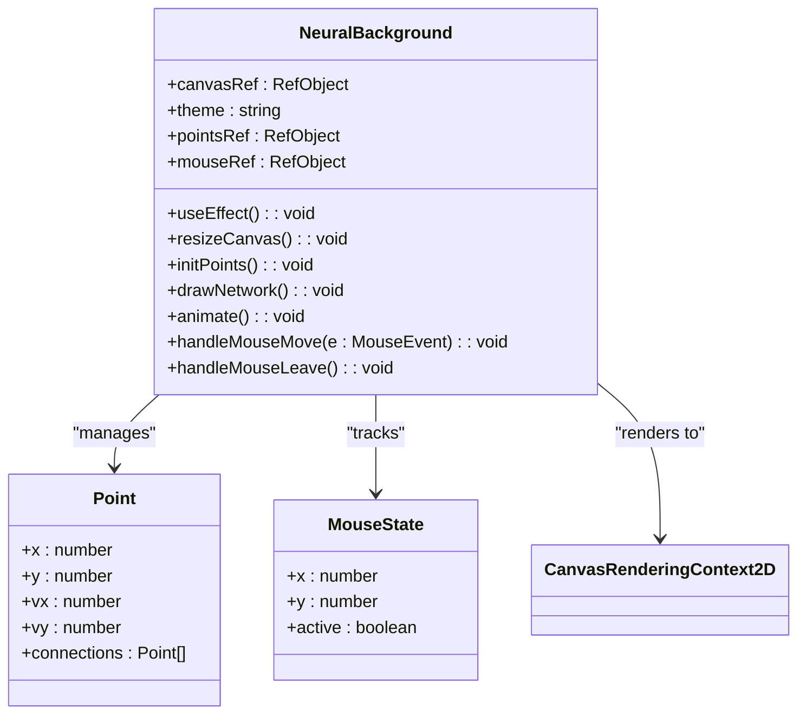
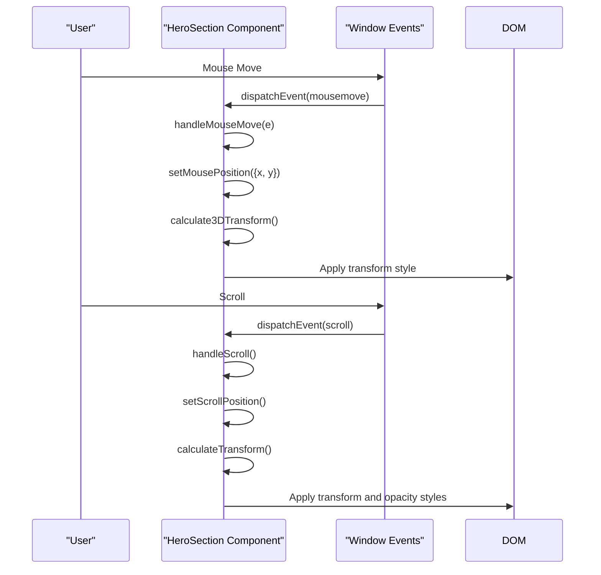
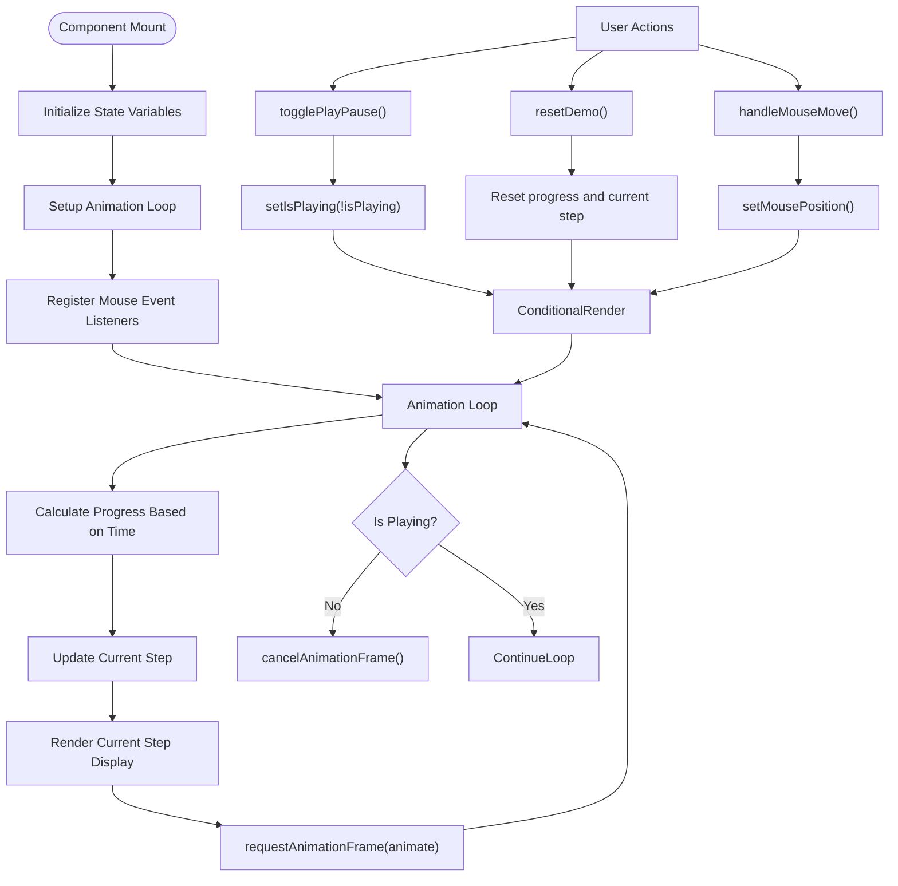
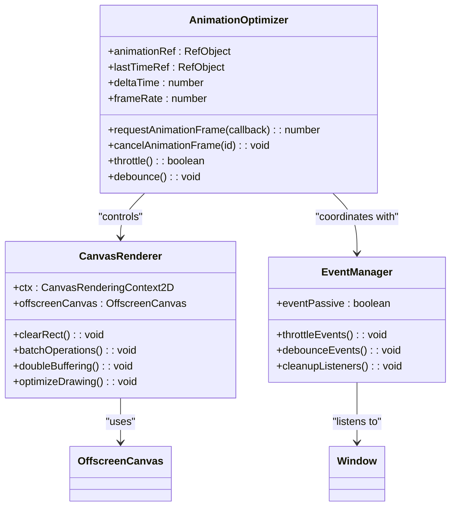
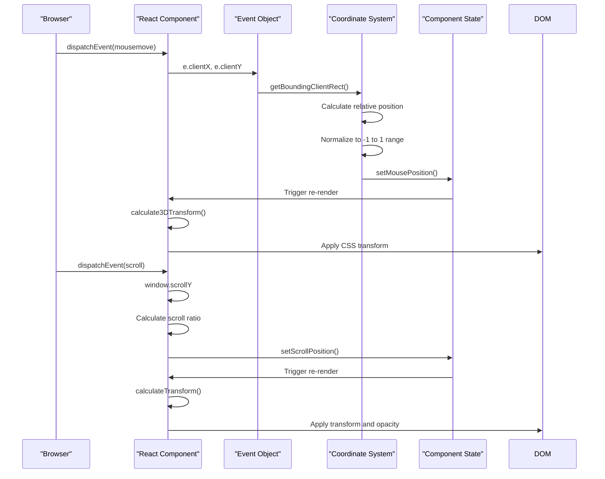

# Interactive Features

<cite>
**Referenced Files in This Document**   
- [NeuralBackground.tsx](file://src/app/components/NeuralBackground.tsx)
- [HeroSection.tsx](file://src/app/components/HeroSection.tsx)
- [LiveDiffDemo.tsx](file://src/app/components/LiveDiffDemo.tsx)
- [ThemeProvider.tsx](file://src/app/components/ThemeProvider.tsx)
- [index.css](file://src/index.css)
- [page.tsx](file://src/app/page.tsx)
</cite>

## Table of Contents
1. [Interactive Features Overview](#interactive-features-overview)
2. [NeuralBackground Component](#neuralbackground-component)
3. [HeroSection 3D and Parallax Effects](#herosection-3d-and-parallax-effects)
4. [LiveDiffDemo Interactive Showcase](#livediffdemo-interactive-showcase)
5. [Animation and Performance Optimization](#animation-and-performance-optimization)
6. [Event Handling and Coordinate Tracking](#event-handling-and-coordinate-tracking)
7. [Browser Compatibility and Performance Pitfalls](#browser-compatibility-and-performance-pitfalls)

## Interactive Features Overview

The async_coder application implements a suite of interactive visual features that enhance user engagement through dynamic animations, responsive interactions, and immersive visual effects. These features are primarily implemented through three key components: NeuralBackground, HeroSection, and LiveDiffDemo. The application leverages HTML5 Canvas for complex visualizations, CSS 3D transforms for depth effects, and React's state management for responsive interactions. Mouse movement and scroll position are captured to drive real-time transformations, creating a dynamic user experience that responds to user input with smooth animations.

**Section sources**
- [page.tsx](file://src/app/page.tsx#L1-L27)
- [index.css](file://src/index.css#L1-L318)

## NeuralBackground Component

The NeuralBackground component renders a dynamic, mouse-responsive neural network visualization using HTML5 Canvas. This component creates an abstract representation of a neural network with interconnected nodes that respond to user interaction.

**Diagram sources**
- [NeuralBackground.tsx](file://src/app/components/NeuralBackground.tsx#L1-L155)

**Section sources**
- [NeuralBackground.tsx](file://src/app/components/NeuralBackground.tsx#L1-L155)

The component initializes a network of points with random positions and velocities, pre-computing connections between nearby points. The visualization features:

- **Dynamic Point Movement**: Each point moves with a small velocity and bounces off canvas boundaries
- **Connection Visualization**: Lines connect points within a 150px radius, creating a network effect
- **Mouse Interaction**: Connections near the mouse cursor are highlighted with increased width and color intensity
- **Theme Adaptation**: Visual appearance changes based on light/dark mode via ThemeProvider

The implementation uses `requestAnimationFrame` for smooth 60fps rendering and efficiently handles canvas resizing. The component optimizes performance by pre-computing connections during initialization rather than calculating them on each frame.

## HeroSection 3D and Parallax Effects

The HeroSection component implements sophisticated 3D transformations and parallax effects driven by mouse movement and scroll position. This creates an immersive, depth-rich experience for users.

**Diagram sources**
- [HeroSection.tsx](file://src/app/components/HeroSection.tsx#L1-L188)

**Section sources**
- [HeroSection.tsx](file://src/app/components/HeroSection.tsx#L1-L188)

The component captures both mouse position and scroll position through event listeners:

- **Mouse Position Tracking**: The `handleMouseMove` function captures normalized mouse coordinates (-1 to 1) relative to the viewport center
- **Scroll Position Tracking**: The `handleScroll` function calculates scroll progress as a normalized value (0 to 1) based on the section's height
- **3D Transformations**: The `calculate3DTransform` function converts mouse coordinates into 3D rotation values (rotateX and rotateY) with perspective
- **Parallax Effects**: The `calculateTransform` function applies vertical translation and opacity changes based on scroll position

Each child element in the hero section can independently apply these transforms with different intensities, creating a layered parallax effect where elements appear to exist at different depths.

## LiveDiffDemo Interactive Showcase

The LiveDiffDemo component showcases the application's code comparison functionality through an interactive, animated demonstration of AI-assisted development.

**Diagram sources**
- [LiveDiffDemo.tsx](file://src/app/components/LiveDiffDemo.tsx#L1-L515)

**Section sources**
- [LiveDiffDemo.tsx](file://src/app/components/LiveDiffDemo.tsx#L1-L515)

The component features:

- **Step-by-Step Animation**: A 5-step process demonstrating AI-assisted development from prompt to pull request
- **Progress-Based Animation**: Uses `requestAnimationFrame` to create a time-based progress animation over 20 seconds
- **Interactive Controls**: Play/pause and reset functionality with visual feedback
- **Mouse-Driven 3D Effect**: Subtle 3D rotation based on mouse position for depth perception
- **Syntax Highlighting**: Client-side code highlighting using regex pattern matching
- **Visual Progress Indicator**: Horizontal progress bar and step indicators showing current position

The animation system uses a delta-time approach to ensure consistent progress regardless of frame rate, calculating progress based on elapsed time rather than frame count.

## Animation and Performance Optimization

The application implements several performance optimization techniques to ensure smooth animations across different devices and browsers.

**Diagram sources**
- [NeuralBackground.tsx](file://src/app/components/NeuralBackground.tsx#L1-L155)
- [LiveDiffDemo.tsx](file://src/app/components/LiveDiffDemo.tsx#L1-L515)

**Section sources**
- [NeuralBackground.tsx](file://src/app/components/NeuralBackground.tsx#L1-L155)
- [LiveDiffDemo.tsx](file://src/app/components/LiveDiffDemo.tsx#L1-L515)

Key optimization strategies include:

- **requestAnimationFrame Usage**: All animations use `requestAnimationFrame` for optimal performance and synchronization with the browser's refresh rate
- **Proper Cleanup**: Event listeners and animation frames are properly cleaned up in useEffect cleanup functions to prevent memory leaks
- **State Batching**: Multiple state updates are batched when possible to reduce re-renders
- **Canvas Optimization**: The NeuralBackground component uses efficient canvas drawing techniques, including pre-computed connections and minimal context state changes
- **Throttled Updates**: Mouse and scroll events are processed directly without additional throttling since they're already limited by the animation frame rate

The NeuralBackground component optimizes performance by:
- Pre-computing point connections during initialization
- Using `ref` objects to store mutable state without triggering re-renders
- Clearing the canvas once per frame rather than for each drawing operation
- Using simple geometric calculations for mouse proximity detection

## Event Handling and Coordinate Tracking

The application implements sophisticated coordinate tracking systems to capture and utilize mouse and scroll position data for interactive effects.

**Diagram sources**
- [HeroSection.tsx](file://src/app/components/HeroSection.tsx#L1-L188)
- [NeuralBackground.tsx](file://src/app/components/NeuralBackground.tsx#L1-L155)
- [LiveDiffDemo.tsx](file://src/app/components/LiveDiffDemo.tsx#L1-L515)

**Section sources**
- [HeroSection.tsx](file://src/app/components/HeroSection.tsx#L1-L188)
- [NeuralBackground.tsx](file://src/app/components/NeuralBackground.tsx#L1-L155)
- [LiveDiffDemo.tsx](file://src/app/components/LiveDiffDemo.tsx#L1-L515)

The coordinate tracking system works as follows:

- **Mouse Coordinates**: Captured via mousemove events and normalized relative to the containing element or viewport
- **Scroll Position**: Calculated as a ratio of current scroll position to section height
- **Coordinate Transformation**: Normalized coordinates are transformed into CSS transform values
- **Event Delegation**: Global window events are used for scroll and mouse movement to capture input regardless of component focus

The HeroSection normalizes mouse coordinates to a -1 to 1 range by subtracting 0.5 from the relative position (e.g., `x = (e.clientX / window.innerWidth - 0.5) * 2`). This creates a coordinate system where (0,0) is the center of the viewport, enabling symmetrical 3D transformations.

## Browser Compatibility and Performance Pitfalls

While the interactive features provide an engaging user experience, there are several potential performance pitfalls and browser compatibility considerations to address.

**Common Performance Pitfalls:**

1. **Excessive Re-renders**: The current implementation could benefit from additional memoization of transformation calculations using `useMemo` or `useCallback`
2. **Canvas Performance**: On lower-end devices, the NeuralBackground animation may drop below 60fps, especially with large numbers of points
3. **Memory Usage**: The point connection system stores references to other points, creating circular references that could impact garbage collection
4. **Event Listener Overhead**: Global event listeners on window could conflict with other components or third-party scripts

**Browser Compatibility Considerations:**

1. **CSS 3D Transforms**: While widely supported, older browsers may not support `perspective()` or 3D transforms
2. **Canvas API**: Universal support in modern browsers, but performance varies significantly across devices
3. **requestAnimationFrame**: Well-supported across modern browsers with fallbacks available
4. **CSS Variables**: Used extensively in the styling system, requiring modern browser support

**Recommended Optimizations:**

- Implement `useMemo` for transformation calculations in HeroSection
- Add a density setting to NeuralBackground to reduce point count on mobile devices
- Use CSS `will-change` property to hint at animated elements
- Implement a performance mode that reduces animation complexity on lower-end devices
- Consider using CSS animations for simpler effects to leverage hardware acceleration

The current implementation demonstrates effective use of modern web APIs for creating engaging interactive experiences while maintaining reasonable performance characteristics across most modern devices.

**Section sources**
- [NeuralBackground.tsx](file://src/app/components/NeuralBackground.tsx#L1-L155)
- [HeroSection.tsx](file://src/app/components/HeroSection.tsx#L1-L188)
- [LiveDiffDemo.tsx](file://src/app/components/LiveDiffDemo.tsx#L1-L515)
- [index.css](file://src/index.css#L1-L318)