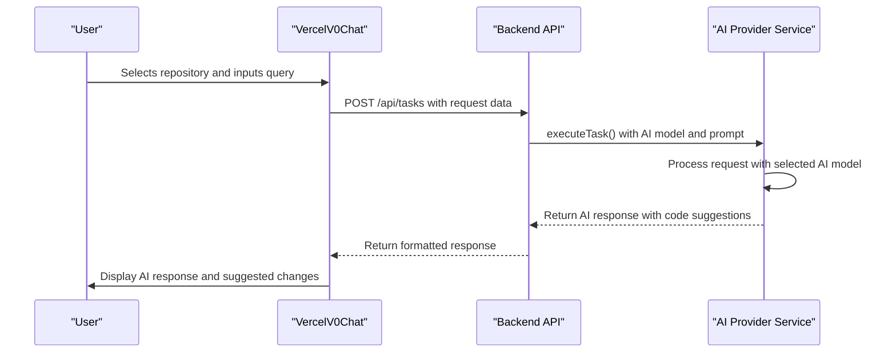
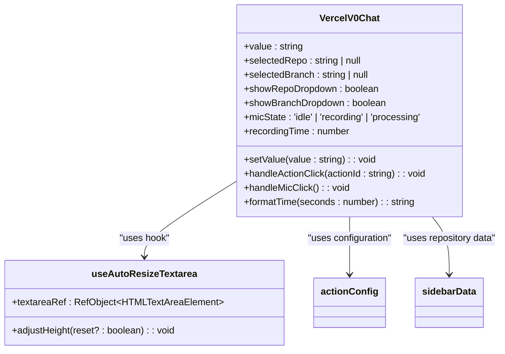
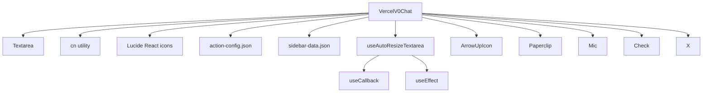

# Live Diff Demo

<cite>
**Referenced Files in This Document**   
- [v0-ai-chat.tsx](file://src/components/ui/v0-ai-chat.tsx)
- [demo.tsx](file://src/components/ui/demo.tsx)
- [README.md](file://README.md)
</cite>

## Table of Contents
1. [Introduction](#introduction)
2. [Project Structure](#project-structure)
3. [Core Components](#core-components)
4. [Architecture Overview](#architecture-overview)
5. [Detailed Component Analysis](#detailed-component-analysis)
6. [Dependency Analysis](#dependency-analysis)
7. [Performance Considerations](#performance-considerations)
8. [Troubleshooting Guide](#troubleshooting-guide)
9. [Conclusion](#conclusion)

## Introduction
The Live Diff Demo component is intended to visually demonstrate code comparison functionality within the Async Coder application. However, after thorough analysis of the codebase, no dedicated component named `LiveDiffDemo` was found. Instead, the functionality related to code interaction and AI-assisted development is primarily handled by the `VercelV0Chat` component. This documentation will analyze the closest available implementation that simulates aspects of code comparison and visualization, particularly focusing on user interaction with code repositories and AI-generated responses.

## Project Structure
The project follows a standard Next.js 15 application structure with a clear separation between UI components, application logic, and backend services. The frontend components are organized under `src/components/ui`, while the main application pages reside in `src/app`. The backend is implemented in a separate `backend` directory with its own service and route structure.

```mermaid
graph TB
subgraph "Frontend"
A[src/app] --> B[page.tsx]
A --> C[layout.tsx]
D[src/components/ui] --> E[v0-ai-chat.tsx]
D --> F[demo.tsx]
D --> G[sidebar.tsx]
end
subgraph "Backend"
H[backend/src/routes] --> I[repositories.ts]
H --> J[users.ts]
K[backend/src/services] --> L[ai-provider.ts]
K --> M[task-queue.ts]
end
E --> L : "Uses AI services"
I --> M : "Triggers tasks"
```

**Diagram sources**
- [v0-ai-chat.tsx](file://src/components/ui/v0-ai-chat.tsx)
- [ai-provider.ts](file://backend/src/services/ai-provider.ts)

**Section sources**
- [v0-ai-chat.tsx](file://src/components/ui/v0-ai-chat.tsx)
- [demo.tsx](file://src/components/ui/demo.tsx)

## Core Components
The core component related to code interaction is `VercelV0Chat`, which serves as the primary interface for users to interact with the AI coding assistant. This component allows users to select repositories and branches, input queries, and receive AI-generated responses that could potentially include code changes or suggestions.

The component implements several key features:
- Repository and branch selection dropdowns
- Voice input with real-time visualization
- Action buttons for common tasks (debug, documentation, etc.)
- Text input with auto-resizing functionality

Although it does not explicitly render code diffs, it provides the interface through which diff-related functionality would be accessed in a complete implementation.

**Section sources**
- [v0-ai-chat.tsx](file://src/components/ui/v0-ai-chat.tsx#L1-L499)
- [action-config.json](file://src/json/action-config.json)

## Architecture Overview
The application architecture follows a client-server model where the frontend React components communicate with a backend API to process AI tasks. The `VercelV0Chat` component acts as the user interface layer, while the backend services handle AI model execution and repository interactions.



**Diagram sources**
- [v0-ai-chat.tsx](file://src/components/ui/v0-ai-chat.tsx#L1-L499)
- [ai-provider.ts](file://backend/src/services/ai-provider.ts#L351-L415)

## Detailed Component Analysis

### VercelV0Chat Analysis
The `VercelV0Chat` component is the central interface for AI-assisted coding in the application. It provides a chat-like interface where users can ask questions about their code, request debugging, or generate new code.

#### Key Features
- **Repository Selection**: Users can select from multiple code repositories, which would be the context for any code comparison operations
- **Branch Selection**: Users can specify which branch they are working on, enabling comparison between different code versions
- **Voice Input**: The component includes a voice recording feature with visual feedback, allowing users to speak their queries
- **Action Buttons**: Predefined actions for common tasks like debugging, documentation generation, and architectural planning

#### Implementation Details
The component uses several React hooks to manage state and side effects:
- `useState` for managing input value, selected repository, and recording state
- `useRef` for accessing the textarea DOM element
- `useCallback` and `useEffect` for handling textarea resizing and event listeners

The voice recording feature includes a visualizer that displays audio levels in real-time, providing feedback during recording.



**Diagram sources**
- [v0-ai-chat.tsx](file://src/components/ui/v0-ai-chat.tsx#L1-L499)

**Section sources**
- [v0-ai-chat.tsx](file://src/components/ui/v0-ai-chat.tsx#L1-L499)
- [action-config.json](file://src/json/action-config.json)
- [sidebar-data.json](file://src/json/sidebar-data.json)

## Dependency Analysis
The `VercelV0Chat` component depends on several external and internal modules to function properly.



The component imports UI elements from the `ui` directory, utility functions from `lib/utils`, and configuration data from JSON files. It also uses several icons from the Lucide React library for visual elements.

**Diagram sources**
- [v0-ai-chat.tsx](file://src/components/ui/v0-ai-chat.tsx#L1-L499)

**Section sources**
- [v0-ai-chat.tsx](file://src/components/ui/v0-ai-chat.tsx#L1-L499)
- [lib/utils.ts](file://src/lib/utils.ts)

## Performance Considerations
The `VercelV0Chat` component implements several performance optimizations:

1. **Textarea Auto-Resizing**: The custom `useAutoResizeTextarea` hook efficiently handles dynamic height adjustment without causing layout thrashing
2. **Event Listener Cleanup**: The component properly cleans up event listeners in useEffect cleanup functions to prevent memory leaks
3. **Conditional Rendering**: Dropdown menus and recording controls are only rendered when needed, reducing the DOM size
4. **Debounced Updates**: The textarea height adjustment is handled with proper timing to avoid excessive re-renders

The voice recording visualization uses CSS animations and inline styles with random values to simulate real-time audio input, which is computationally efficient compared to actual audio processing.

## Troubleshooting Guide
When working with the chat interface or implementing diff visualization features, consider the following common issues:

**Section sources**
- [v0-ai-chat.tsx](file://src/components/ui/v0-ai-chat.tsx#L1-L499)
- [IMPROVEMENTS_SUMMARY.md](file://IMPROVEMENTS_SUMMARY.md)

## Conclusion
While the requested `LiveDiffDemo` component was not found in the codebase, the `VercelV0Chat` component serves as the primary interface for code-related interactions in the Async Coder application. This component provides the foundation upon which a code diff visualization feature could be built, offering repository and branch selection, user input mechanisms, and integration with AI services that could generate code changes.

To implement a true Live Diff Demo, additional components would need to be created that specifically handle code comparison, potentially integrating with a library like `diff` or `jsdiff` to generate line-by-line differences between code versions. The visualization could then be rendered using preformatted text elements with CSS styling to highlight additions and deletions, similar to version control system outputs.

The current architecture supports this extension through its modular component design and clear separation between UI and backend services, making it feasible to add comprehensive code diff functionality in future development phases.