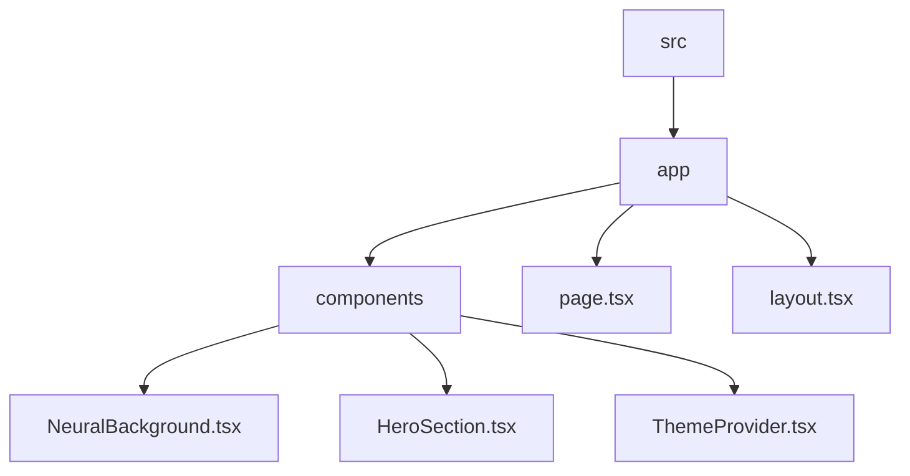
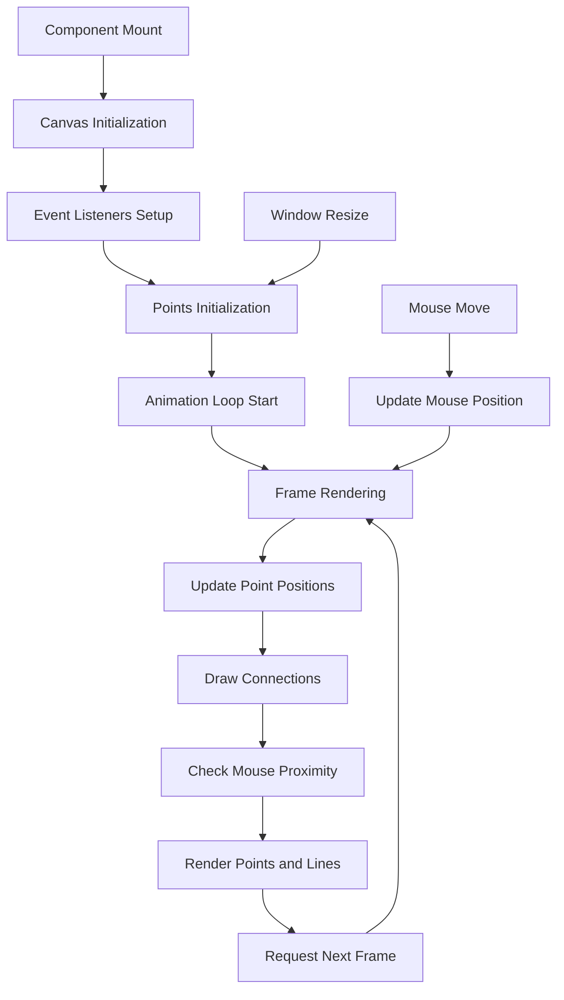
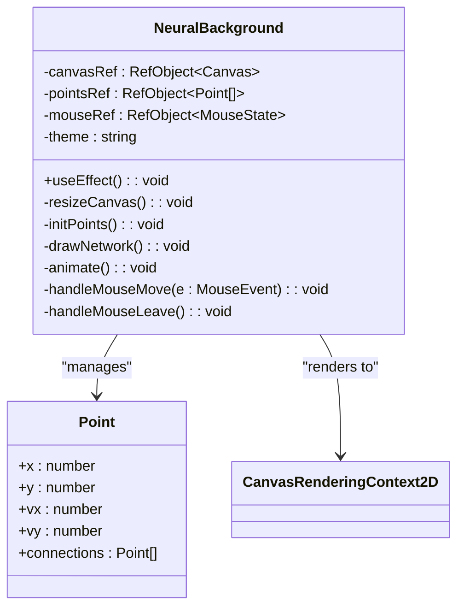

# Neural Background

<cite>
**Referenced Files in This Document**   
- [NeuralBackground.tsx](file://src/app/components/NeuralBackground.tsx)
- [HeroSection.tsx](file://src/app/components/HeroSection.tsx)
- [ThemeProvider.tsx](file://src/app/components/ThemeProvider.tsx)
</cite>

## Table of Contents
1. [Introduction](#introduction)
2. [Project Structure](#project-structure)
3. [Core Components](#core-components)
4. [Architecture Overview](#architecture-overview)
5. [Detailed Component Analysis](#detailed-component-analysis)
6. [Performance Considerations](#performance-considerations)
7. [Integration with HeroSection](#integration-with-herosection)
8. [Conclusion](#conclusion)

## Introduction
The NeuralBackground component is a dynamic, interactive visualization that renders a neural network-style particle system using HTML5 Canvas. It enhances the user experience on the landing page by providing an engaging background animation that responds to mouse movement. The component leverages React's useEffect and useRef hooks for lifecycle management and DOM interaction, while using requestAnimationFrame for smooth, performant animations. This documentation provides a comprehensive analysis of its implementation, architecture, and integration within the application.

**Section sources**
- [NeuralBackground.tsx](file://src/app/components/NeuralBackground.tsx)

## Project Structure
The project follows a Next.js App Router structure with components organized in a feature-based hierarchy. The NeuralBackground component resides in the components directory alongside other UI elements such as HeroSection, Header, and Footer. The component is implemented as a client-side React component using TypeScript, following modern React patterns with hooks and type safety.



**Diagram sources**
- [NeuralBackground.tsx](file://src/app/components/NeuralBackground.tsx)
- [HeroSection.tsx](file://src/app/components/HeroSection.tsx)

**Section sources**
- [NeuralBackground.tsx](file://src/app/components/NeuralBackground.tsx)
- [HeroSection.tsx](file://src/app/components/HeroSection.tsx)

## Core Components
The NeuralBackground component is the primary focus, implementing a particle system with interconnected nodes that animate across the canvas. It captures mouse movement to create interactive effects, where lines near the cursor become more prominent. The component is theme-aware, adjusting its color scheme based on the current theme (dark/light) through the useTheme hook. The particle system consists of nodes (points) with velocity properties that bounce off canvas boundaries, creating continuous motion.

**Section sources**
- [NeuralBackground.tsx](file://src/app/components/NeuralBackground.tsx)

## Architecture Overview
The NeuralBackground component follows a reactive architecture pattern, using React's useEffect hook to initialize and manage the canvas rendering lifecycle. It employs a continuous animation loop via requestAnimationFrame, which calls the drawNetwork function on each frame. The architecture separates concerns into initialization (resizeCanvas, initPoints), rendering (drawNetwork), animation (animate), and event handling (handleMouseMove, handleMouseLeave). The component uses useRef to maintain mutable references to the canvas, points array, and mouse position without triggering re-renders.



**Diagram sources**
- [NeuralBackground.tsx](file://src/app/components/NeuralBackground.tsx)

## Detailed Component Analysis

### NeuralBackground Implementation
The NeuralBackground component implements a complete canvas-based particle system with interactive features. It begins by creating references to the canvas element, theme context, points array, and mouse position using useRef. The useEffect hook initializes the canvas context and sets up the rendering pipeline.

#### Particle System Architecture


**Diagram sources**
- [NeuralBackground.tsx](file://src/app/components/NeuralBackground.tsx#L3-L155)

**Section sources**
- [NeuralBackground.tsx](file://src/app/components/NeuralBackground.tsx#L10-L155)

#### Node Creation and Connection Logic
The particle system creates nodes dynamically based on canvas size, with density calculated as approximately one point per 15,000 pixels. Each point is initialized with random position and velocity:

```typescript
const numPoints = Math.floor((canvas.width * canvas.height) / 15000)
for (let i = 0; i < numPoints; i++) {
  points.push({
    x: Math.random() * canvas.width,
    y: Math.random() * canvas.height,
    vx: (Math.random() - 0.5) * 0.5,
    vy: (Math.random() - 0.5) * 0.5,
    connections: [],
  })
}
```

Connections between points are pre-computed during initialization, creating a static network topology where points within 150 pixels are linked:

```typescript
for (let i = 0; i < points.length; i++) {
  for (let j = i + 1; j < points.length; j++) {
    const dx = points[i].x - points[j].x
    const dy = points[i].y - points[j].y
    const distance = Math.sqrt(dx * dx + dy * dy)
    if (distance < 150) {
      points[i].connections.push(points[j])
    }
  }
}
```

#### Mouse Interaction and Coordinate Processing
The component captures mouse movement through event listeners and normalizes coordinates relative to the canvas:

```typescript
const handleMouseMove = (e: MouseEvent) => {
  const rect = canvas.getBoundingClientRect()
  mouseRef.current = {
    x: e.clientX - rect.left,
    y: e.clientY - rect.top,
    active: true,
  }
}
```

The system checks if the mouse is near any connection line by calculating the perpendicular distance from the mouse to the line segment. This creates an interactive effect where nearby lines become more prominent:

```typescript
const v1 = { x: mx - point.x, y: my - point.y }
const v2 = { x: mx - connectedPoint.x, y: my - connectedPoint.y }
const dot1 = v1.x * lineDirection.x + v1.y * lineDirection.y
const dot2 = v2.x * -lineDirection.x + v2.y * -lineDirection.y
isActive = dot1 > 0 && dot2 > 0 && Math.abs(v1.x * lineDirection.y - v1.y * lineDirection.x) < 50
```

#### Animation Loop Implementation
The animation loop uses requestAnimationFrame for optimal performance, ensuring smooth 60fps rendering:

```typescript
const animate = () => {
  drawNetwork()
  requestAnimationFrame(animate)
}
```

The drawNetwork function clears the canvas and redraws all elements on each frame, updating point positions and applying boundary collision detection:

```typescript
point.x += point.vx
point.y += point.vy
if (point.x < 0 || point.x > canvas.width) point.vx *= -1
if (point.y < 0 || point.y > canvas.height) point.vy *= -1
```

#### Canvas Rendering with 2D Context
The component uses 2D canvas context methods to draw circles for points and lines for connections. Visual styling includes theme-based color schemes and interactive feedback:

```typescript
// Draw point
ctx.beginPath()
ctx.arc(point.x, point.y, 2, 0, Math.PI * 2)
ctx.fillStyle = pointColor
ctx.fill()

// Draw connection
ctx.beginPath()
ctx.moveTo(point.x, point.y)
ctx.lineTo(connectedPoint.x, connectedPoint.y)
ctx.strokeStyle = isActive ? activeLineColor : lineColor
ctx.lineWidth = isActive ? 1.5 : 0.5
ctx.stroke()
```

Color schemes adapt to the current theme:
- **Dark theme**: White/gray elements with cyan/orange active lines
- **Light theme**: Dark gray elements with red active lines

## Performance Considerations
The NeuralBackground component implements several performance optimizations to ensure smooth rendering across devices.

### Canvas Resizing and Pixel Density
The canvas is resized to match the window dimensions with a 1.2x height multiplier to cover scrolling content:

```typescript
canvas.width = window.innerWidth
canvas.height = window.innerHeight * 1.2
```

The component automatically reinitializes points when the canvas is resized, maintaining appropriate density.

### Event Listener Management
All event listeners are properly cleaned up on component unmount to prevent memory leaks:

```typescript
return () => {
  window.removeEventListener('resize', resizeCanvas)
  canvas.removeEventListener('mousemove', handleMouseMove)
  canvas.removeEventListener('mouseleave', handleMouseLeave)
}
```

### Animation Management
The animation loop runs continuously via requestAnimationFrame, which synchronizes with the browser's refresh rate for optimal performance. The component does not implement explicit throttling of mouse events, relying on the animation loop's frame rate to naturally limit update frequency.

### Rendering Optimization
The component uses several techniques to optimize rendering:
- Pre-computing connections during initialization rather than on each frame
- Using ref objects to avoid unnecessary re-renders
- Clearing only the necessary canvas area
- Minimizing DOM operations within the animation loop

**Section sources**
- [NeuralBackground.tsx](file://src/app/components/NeuralBackground.tsx#L25-L155)

## Integration with HeroSection
The NeuralBackground component is integrated into the HeroSection as a visual enhancement, providing a dynamic backdrop that complements the landing page content.

### Component Integration
The NeuralBackground is imported and rendered within the HeroSection component:

```typescript
import { NeuralBackground } from './NeuralBackground'

// In HeroSection JSX:
<NeuralBackground />
```

### Visual Hierarchy
The component is positioned absolutely behind other content using CSS:

```tsx
<canvas
  ref={canvasRef}
  className="absolute top-0 left-0 w-full h-[120vh] -z-10 opacity-40"
/>
```

The z-index of -10 ensures it appears behind all other elements, while the opacity of 0.4 prevents it from overwhelming the foreground content.

### Theme Integration
The NeuralBackground component consumes the theme context from ThemeProvider, ensuring visual consistency with the rest of the application:

```typescript
const { theme } = useTheme()
```

The ThemeProvider implementation saves the theme preference to localStorage and applies a 'dark' class to the document element, which is used by CSS variables in the HeroSection's gradient background.

### User Experience Enhancement
The interactive neural network visualization creates an engaging first impression for visitors, conveying themes of technology, connectivity, and intelligence that align with the product's AI-focused value proposition. The subtle mouse interaction provides immediate feedback, encouraging exploration and creating a sense of depth in the interface.

**Section sources**
- [HeroSection.tsx](file://src/app/components/HeroSection.tsx#L55)
- [NeuralBackground.tsx](file://src/app/components/NeuralBackground.tsx)
- [ThemeProvider.tsx](file://src/app/components/ThemeProvider.tsx)

## Conclusion
The NeuralBackground component successfully implements a performant, interactive particle system that enhances the visual appeal of the landing page. Its architecture demonstrates effective use of React hooks, canvas rendering, and animation techniques. The component is well-integrated with the application's theme system and provides a smooth user experience across different devices. By leveraging requestAnimationFrame and efficient rendering patterns, it maintains good performance while delivering an engaging visual effect that supports the product's branding and user experience goals.