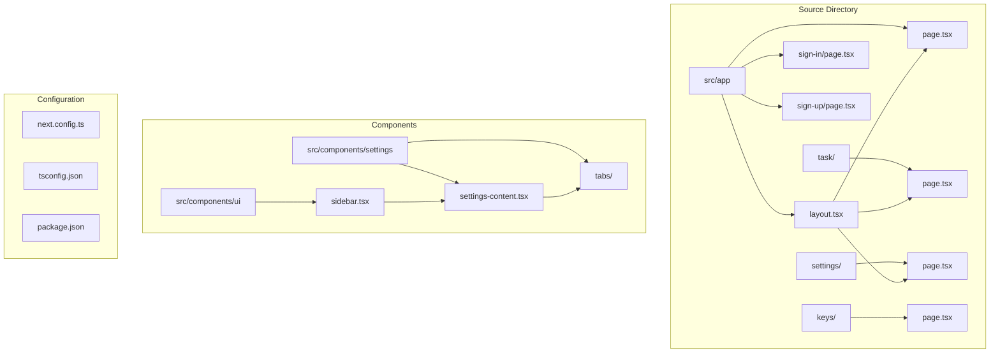
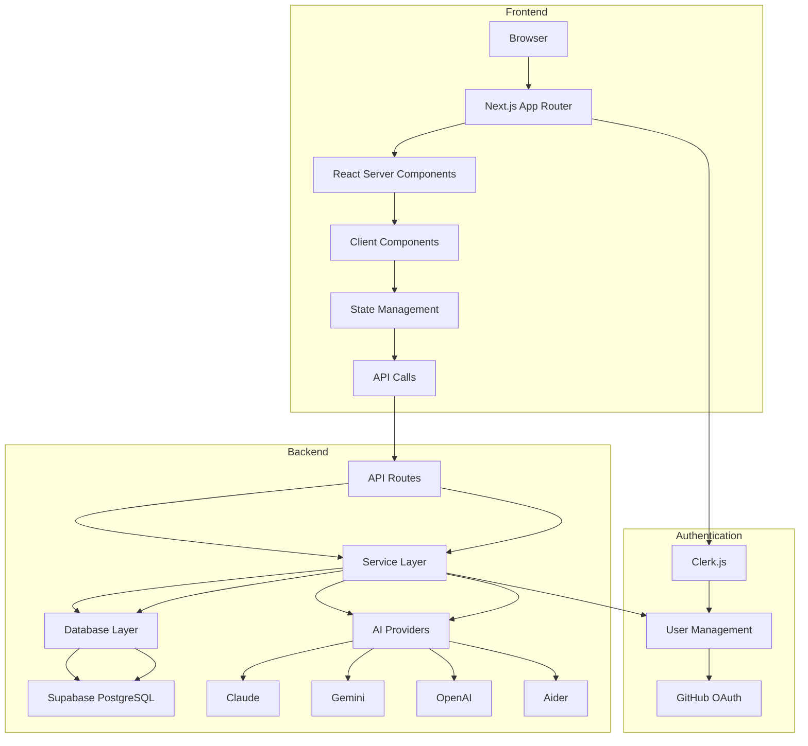
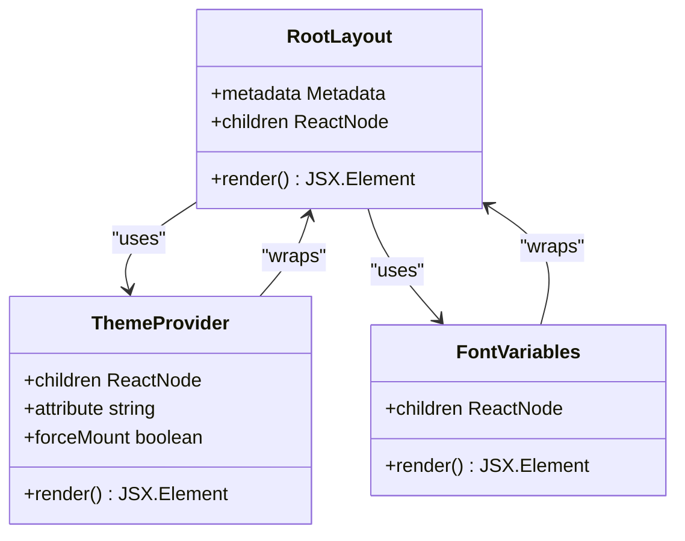
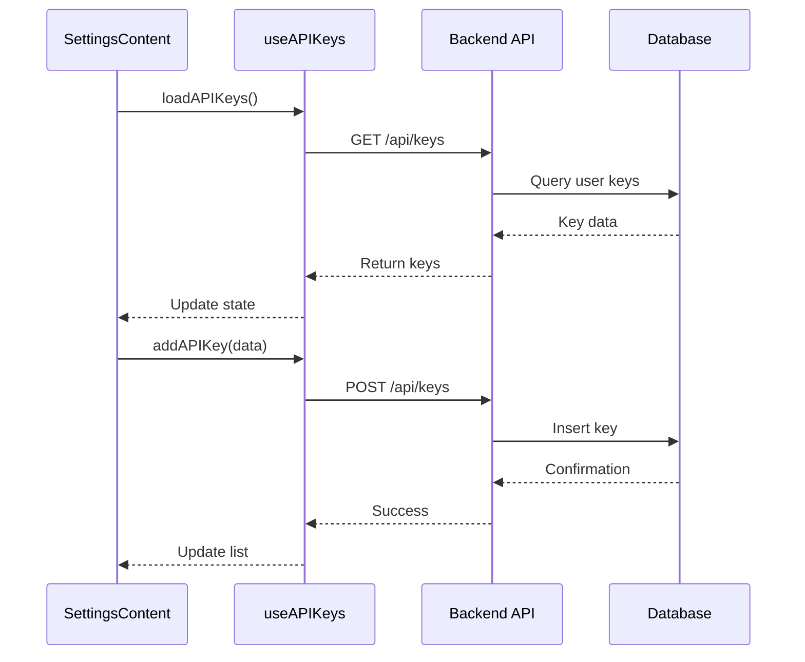
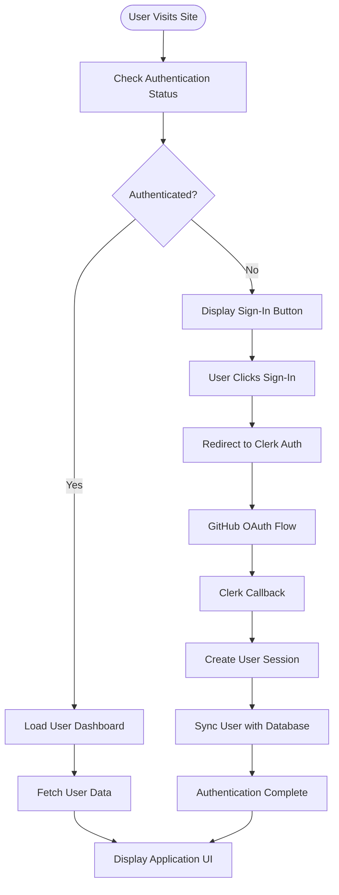
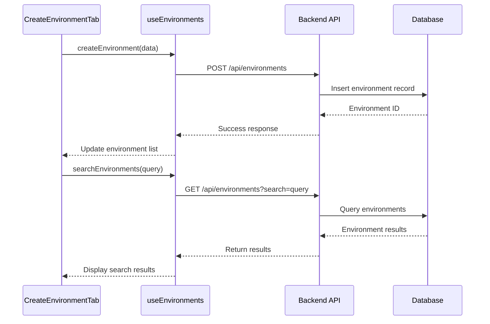
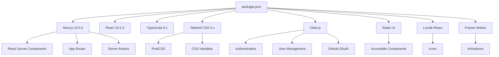

# Python Backend Architecture

<cite>
**Referenced Files in This Document**   
- [DATABASE_DESIGN.md](file://DATABASE_DESIGN.md)
- [REQUIREMENTS.md](file://REQUIREMENTS.md)
- [README.md](file://README.md)
- [WARP.md](file://WARP.md)
- [src/app/page.tsx](file://src/app/page.tsx)
- [src/app/layout.tsx](file://src/app/layout.tsx)
- [src/app/globals.css](file://src/app/globals.css)
- [src/components/ui/sidebar.tsx](file://src/components/ui/sidebar.tsx)
- [src/components/settings/settings-content.tsx](file://src/components/settings/settings-content.tsx)
- [src/hooks/use-api-keys.ts](file://src/hooks/use-api-keys.ts)
- [src/json/sidebar-data.json](file://src/json/sidebar-data.json)
- [next.config.ts](file://next.config.ts)
- [tsconfig.json](file://tsconfig.json)
- [package.json](file://package.json)
- [backend/app/schema/newschema.sql](file://backend/app/schema/newschema.sql) - *Added in commit 2b6172772448311798bed697f2b15a9c7fe687de*
</cite>

## Update Summary
**Changes Made**   
- Added new section on Environments Management System to reflect new database schema and UI features
- Updated Architecture Overview to include environments management component
- Enhanced Dependency Analysis with new database schema details
- Added new sequence diagram for environments management workflow
- Updated section sources to include new schema file

## Table of Contents
1. [Introduction](#introduction)
2. [Project Structure](#project-structure)
3. [Core Components](#core-components)
4. [Architecture Overview](#architecture-overview)
5. [Detailed Component Analysis](#detailed-component-analysis)
6. [Environments Management System](#environments-management-system)
7. [Dependency Analysis](#dependency-analysis)
8. [Performance Considerations](#performance-considerations)
9. [Troubleshooting Guide](#troubleshooting-guide)
10. [Conclusion](#conclusion)

## Introduction

Async Coder is an open-source, end-to-end AI coding assistant designed to empower developers with autonomous development capabilities. The platform supports multiple AI backends including Claude, Gemini, Aider, and custom in-house models, enabling users to debug, write, refactor, document, test, and manage pull requests through a modern web interface. Built with Next.js 15, React 19, and TypeScript, the application features a modular architecture with Clerk.js for authentication, Supabase for database management, and Drizzle ORM for type-safe database operations. This document provides a comprehensive analysis of the backend architecture, focusing on its implementation details, API interfaces, configuration system, and integration patterns with the frontend.

## Project Structure

The project follows a feature-based organization within the Next.js App Router architecture. The core application resides in the `src/app` directory, while reusable components are organized under `src/components`. Configuration files and utility modules support the main application logic.

**Section sources**
- [src/app/page.tsx](file://src/app/page.tsx#L1-L100)
- [src/app/layout.tsx](file://src/app/layout.tsx#L1-L80)
- [src/app/globals.css](file://src/app/globals.css#L1-L50)

## Core Components

The core components of Async Coder include the main application layout, routing structure, authentication system, and settings management interface. The `layout.tsx` file serves as the root layout component, wrapping all pages with theme providers and global styles. The `page.tsx` file implements the landing page with feature sections and navigation. Authentication is handled through Clerk.js, with dedicated sign-in and sign-up pages. The task dashboard provides access to AI coding features, while the settings pages allow users to manage API keys and preferences.

The application leverages React Server Components extensively, with client-side interactivity added where needed through 'use client' directives. The sidebar component renders navigation items based on data from `sidebar-data.json`, providing dynamic menu generation. Settings tabs are implemented as separate components under the `settings/tabs` directory, enabling modular configuration management.

**Section sources**
- [src/app/page.tsx](file://src/app/page.tsx#L1-L150)
- [src/app/layout.tsx](file://src/app/layout.tsx#L1-L100)
- [src/components/ui/sidebar.tsx](file://src/components/ui/sidebar.tsx#L1-L80)
- [src/json/sidebar-data.json](file://src/json/sidebar-data.json#L1-L20)

## Architecture Overview

The Async Coder architecture follows a modern full-stack Next.js pattern with clear separation between frontend and backend concerns. The frontend implements a component-based UI with React Server Components, while the backend services handle data persistence, AI integrations, and business logic.

**Diagram sources**
- [DATABASE_DESIGN.md](file://DATABASE_DESIGN.md#L1-L50)
- [README.md](file://README.md#L1-L100)
- [src/app/layout.tsx](file://src/app/layout.tsx#L1-L30)

## Detailed Component Analysis

### Main Application Layout Analysis

The root layout component provides the structural foundation for the entire application, including theme management, font loading, and metadata configuration.

**Diagram sources**
- [src/app/layout.tsx](file://src/app/layout.tsx#L1-L50)
- [src/app/globals.css](file://src/app/globals.css#L1-L30)

#### For API/Service Components:

The settings management system demonstrates a clean separation between UI components and data handling logic, with custom hooks managing API key state.

**Diagram sources**
- [src/components/settings/settings-content.tsx](file://src/components/settings/settings-content.tsx#L1-L40)
- [src/hooks/use-api-keys.ts](file://src/hooks/use-api-keys.ts#L1-L50)

### Authentication Flow Analysis

The authentication system leverages Clerk.js for secure user management with GitHub OAuth integration.

**Diagram sources**
- [src/app/sign-in/page.tsx](file://src/app/sign-in/page.tsx#L1-L30)
- [src/app/sign-up/page.tsx](file://src/app/sign-up/page.tsx#L1-L25)

## Environments Management System

The new environments management system enables users to create, search, and manage development environments with custom configurations. This feature is supported by a comprehensive database schema that stores environment configurations and relationships.

The system allows users to:
- Create new environments with custom names and configurations
- Search and filter existing environments
- Manage environment variables and settings
- Associate environments with specific AI models and API keys

**Diagram sources**
- [backend/app/schema/newschema.sql](file://backend/app/schema/newschema.sql#L1-L50) - *New environments schema*
- [src/components/settings/tabs/CreateEnvironmentTab.tsx](file://src/components/settings/tabs/CreateEnvironmentTab.tsx#L1-L40) - *UI component*

**Section sources**
- [backend/app/schema/newschema.sql](file://backend/app/schema/newschema.sql) - *Added in commit 2b6172772448311798bed697f2b15a9c7fe687de*
- [src/components/settings/tabs/CreateEnvironmentTab.tsx](file://src/components/settings/tabs/CreateEnvironmentTab.tsx)
- [src/components/settings/tabs/EnvironmentsTab.tsx](file://src/components/settings/tabs/EnvironmentsTab.tsx)

## Dependency Analysis

The project dependencies are managed through npm with a focus on modern JavaScript tooling. The architecture shows a clear dependency hierarchy from the application layer down to utility modules.

**Diagram sources**
- [package.json](file://package.json#L1-L50)
- [next.config.ts](file://next.config.ts#L1-L20)
- [tsconfig.json](file://tsconfig.json#L1-L30)

**Section sources**
- [package.json](file://package.json#L1-L100)
- [next.config.ts](file://next.config.ts#L1-L50)
- [tsconfig.json](file://tsconfig.json#L1-L50)
- [backend/app/schema/newschema.sql](file://backend/app/schema/newschema.sql) - *Updated database schema*

## Performance Considerations

The application architecture incorporates several performance optimizations:

- **Code Splitting**: Next.js automatically splits code by route, loading only necessary components
- **Image Optimization**: Built-in Next.js Image component for optimized asset delivery
- **Font Optimization**: Geist fonts loaded with variable font properties to reduce payload
- **Server Components**: Extensive use of React Server Components minimizes client-side JavaScript
- **Caching**: Strategic caching of API responses and database queries
- **Bundle Size**: Tree-shaking and dead code elimination through modern build tooling

The configuration files indicate additional performance features:
- ESLint with Next.js rules for code quality
- PostCSS with Tailwind CSS for efficient CSS generation
- TypeScript with strict mode for early error detection
- Path aliases (`@/*`) for cleaner imports and potential bundler optimizations

## Troubleshooting Guide

Common issues and their solutions:

**Section sources**
- [WARP.md](file://WARP.md#L1-L100)
- [REQUIREMENTS.md](file://REQUIREMENTS.md#L1-L50)
- [README.md](file://README.md#L1-L100)

### Development Server Issues
- **Problem**: Development server fails to start
- **Solution**: Ensure all dependencies are installed with `npm install` and check Node.js version compatibility

### Authentication Problems
- **Problem**: Sign-in fails with GitHub OAuth
- **Solution**: Verify Clerk.js configuration and ensure proper environment variables are set

### Styling Inconsistencies
- **Problem**: Components appear incorrectly in light/dark mode
- **Solution**: Audit CSS variables in `globals.css` and ensure proper use of Tailwind classes

### API Integration Errors
- **Problem**: AI backend integrations fail
- **Solution**: Check API key configuration in environment variables and verify network connectivity

### Database Connection Issues
- **Problem**: Unable to connect to Supabase
- **Solution**: Validate database URL and credentials in environment configuration

## Conclusion

Async Coder presents a sophisticated architecture for an AI-powered coding assistant, combining modern frontend technologies with robust backend services. The Next.js App Router provides a solid foundation for server-side rendering and API routes, while the component-based design ensures maintainability and scalability. The integration of multiple AI backends through a unified interface allows flexibility in AI model selection, and the credit system enables usage tracking and potential monetization. The database design with Supabase and Drizzle ORM offers type safety and real-time capabilities, supporting the application's collaborative features. With its open-source nature and extensible architecture, Async Coder is well-positioned to evolve into a comprehensive AI development platform.