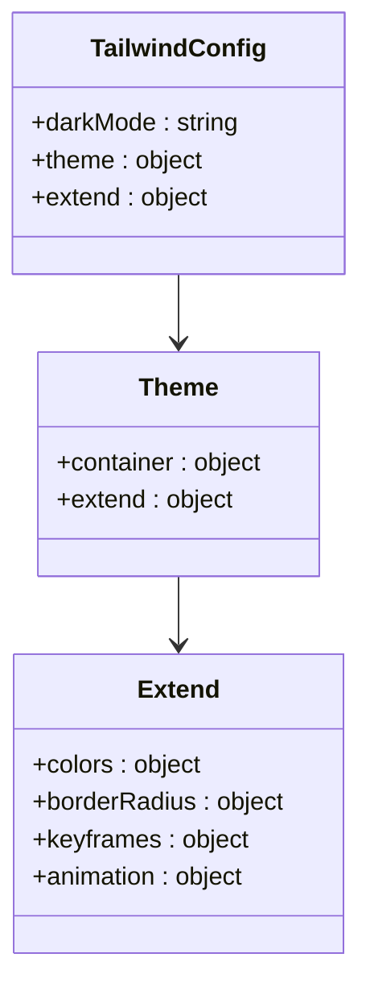
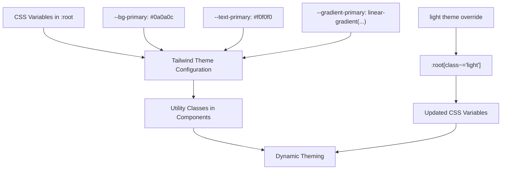
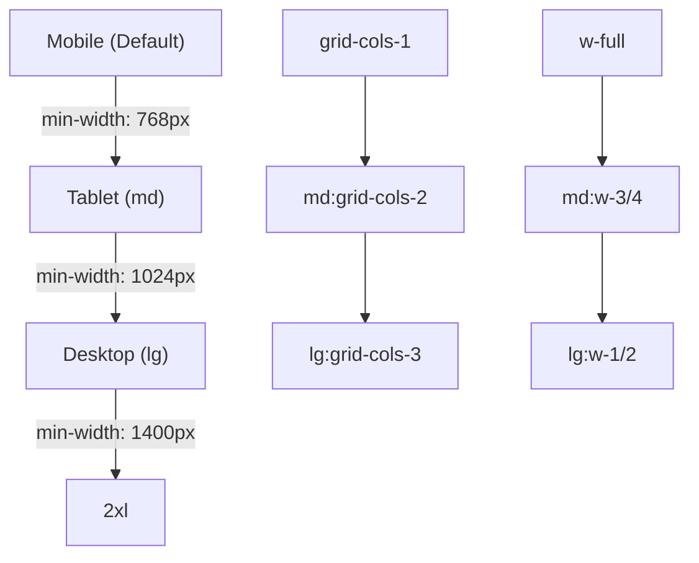
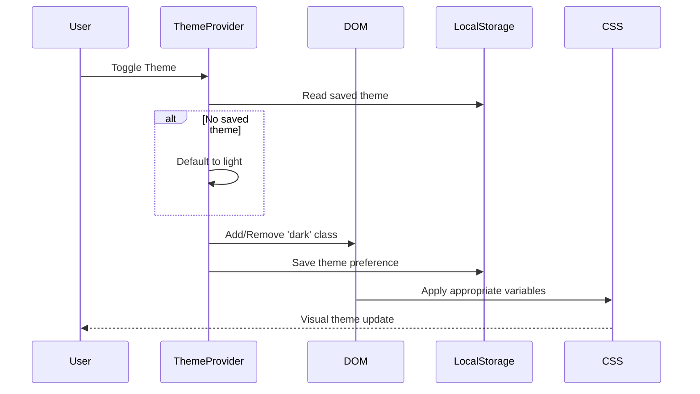
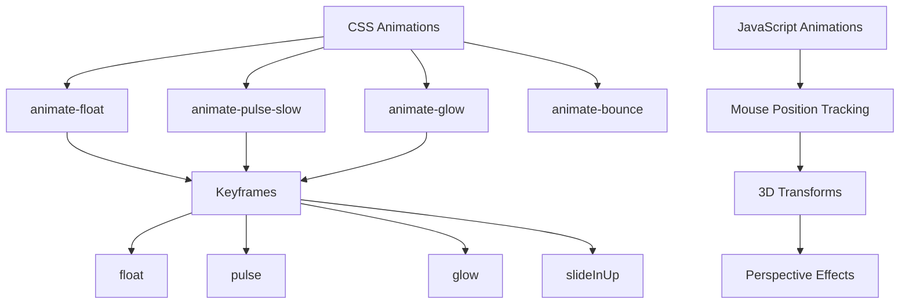
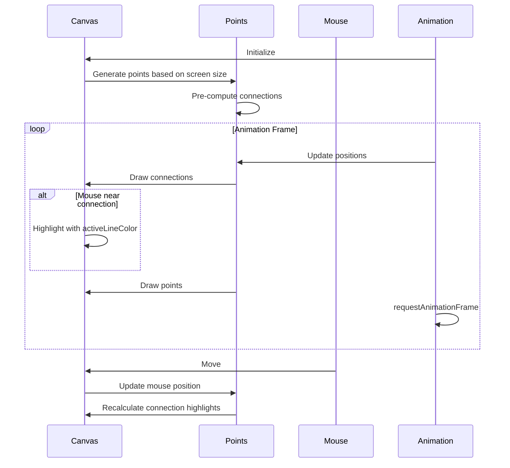

# Styling Strategy

<cite>
**Referenced Files in This Document**   
- [tailwind.config.ts](file://tailwind.config.ts)
- [globals.css](file://src\app\globals.css)
- [ThemeProvider.tsx](file://src\app\components\ThemeProvider.tsx)
- [NeuralBackground.tsx](file://src\app\components\NeuralBackground.tsx)
- [FeaturesSection.tsx](file://src\components\FeaturesSection.tsx)
- [LiveDiffDemo.tsx](file://src\app\components\LiveDiffDemo.tsx)
- [PricingSection.tsx](file://src\app\components\PricingSection.tsx)
- [HeroSection.tsx](file://src\app\components\HeroSection.tsx)
- [ProblemSolutionSection.tsx](file://src\app\components\ProblemSolutionSection.tsx)
- [CreateEnvironmentTab.tsx](file://src\components\settings\tabs\CreateEnvironmentTab.tsx) - *Updated in commit 98fef570ad4dc0b8302e40bf6ebd464afe77a23d*
</cite>

## Update Summary
**Changes Made**   
- Updated scrollbar styling documentation to reflect the use of utility classes
- Added documentation for the `scrollbar-hide` utility class in globals.css
- Removed references to inline scrollbar styles that were removed in the recent commit
- Updated section sources to include the modified CreateEnvironmentTab.tsx file

## Table of Contents
1. [Styling Strategy](#styling-strategy)
2. [Tailwind CSS Configuration](#tailwind-css-configuration)
3. [CSS Variables and Theme Integration](#css-variables-and-theme-integration)
4. [Responsive Design Implementation](#responsive-design-implementation)
5. [Dark Mode and Theme Management](#dark-mode-and-theme-management)
6. [Animation and Interaction Effects](#animation-and-interaction-effects)
7. [Visual Effects and Component Styling](#visual-effects-and-component-styling)
8. [Design System Extension Guidelines](#design-system-extension-guidelines)

## Tailwind CSS Configuration

The async_coder application implements a utility-first styling approach using Tailwind CSS with Just-In-Time (JIT) mode enabled through the `tailwind.config.ts` configuration file. This setup allows for rapid development with atomic classes while maintaining performance through on-demand generation of CSS rules.

The configuration extends Tailwind's default theme with custom color definitions that utilize CSS variables for dynamic theming. The `darkMode` is set to "selector" strategy, enabling explicit control over theme switching through CSS class manipulation rather than relying on system preferences.



**Section sources**
- [tailwind.config.ts](file://tailwind.config.ts#L1-L73)

## CSS Variables and Theme Integration

The styling system leverages CSS variables defined in `globals.css` to create a dynamic, theme-aware design system that integrates seamlessly with Tailwind CSS. The `:root` selector defines a comprehensive set of variables for colors, typography, gradients, and layout properties, enabling consistent theming across the application.

The CSS variables follow a structured naming convention with prefixes indicating their purpose:
- `--c-*` for brand and technology colors
- `--bg-*` for background colors
- `--text-*` for text colors
- `--gradient-*` for gradient definitions
- `--font-*` for typography

These variables are consumed by Tailwind through the `hsl(var(--variable))` syntax in the Tailwind configuration, creating a bridge between the utility classes and the dynamic theme system.



**Section sources**
- [globals.css](file://src\app\globals.css#L12-L220)
- [tailwind.config.ts](file://tailwind.config.ts#L4-L73)

## Responsive Design Implementation

The application implements a mobile-first responsive design strategy using Tailwind's breakpoint system. The configuration extends the default breakpoints with a custom "2xl" screen size of 1400px, providing enhanced control over layout at larger screen sizes.

The responsive strategy employs several key techniques:
- Container-based layout with centering and consistent padding
- Responsive grid systems for content organization
- Flexible flexbox layouts for dynamic content arrangement
- Viewport-relative sizing for scalable elements

Component examples demonstrate the use of responsive classes such as `grid-cols-1 md:grid-cols-2 lg:grid-cols-3` in the ProblemSolutionSection component, which creates a responsive grid that adapts from single column on mobile to three columns on large screens.



**Section sources**
- [tailwind.config.ts](file://tailwind.config.ts#L5-L9)
- [ProblemSolutionSection.tsx](file://src\app\components\ProblemSolutionSection.tsx#L105-L143)
- [HeroSection.tsx](file://src\app\components\HeroSection.tsx)

## Dark Mode and Theme Management

The application implements a sophisticated dark mode system using the `ThemeProvider` component, which manages theme state and persists user preferences to localStorage. The theme system supports both dark and light modes with smooth transitions between them.

The `ThemeProvider` uses React's Context API to provide theme state and toggle functionality to all components in the application. When the theme changes, the component updates the DOM by adding or removing the "dark" class from the documentElement, which triggers the appropriate CSS variable overrides defined in the stylesheet.



**Section sources**
- [ThemeProvider.tsx](file://src\app\components\ThemeProvider.tsx#L8-L40)
- [globals.css](file://src\app\globals.css#L12-L220)

## Animation and Interaction Effects

The styling system incorporates a comprehensive set of animation classes and interactive effects to enhance user experience. These animations are defined both in CSS and through dynamic component behavior.

The `globals.css` file defines several key animation classes:
- `animate-float`: A floating animation with 6-second duration
- `animate-pulse-slow`: A slow pulse effect for subtle attention-grabbing
- `animate-glow`: A glowing effect that alternates in intensity
- `animate-bounce`: Used for scroll indicators and other interactive elements

Additionally, components implement more complex animations through React state and mouse event handling, such as the 3D transform effects in HeroSection that respond to mouse movement.



**Section sources**
- [globals.css](file://src\app\globals.css#L222-L250)
- [HeroSection.tsx](file://src\app\components\HeroSection.tsx#L34-L66)
- [TrustBar.tsx](file://src\app\components\TrustBar.tsx#L56-L91)

## Visual Effects and Component Styling

The application employs several advanced visual effects to create a modern, engaging interface. These effects include glassmorphism, gradient text, and animated background layers.

### Glassmorphism Implementation
The glassmorphism effect is implemented through the `.glass` and `.glass-hover` classes, which use backdrop-filter for blur effects and semi-transparent backgrounds. The effect intensifies on hover with increased blur and saturation.

```mermaid
classDiagram
class GlassEffect {
+backdrop-filter : blur(16px) saturate(180%)
+background-color : var(--bg-glass)
+border : 1px solid var(--border-primary)
}
class GlassHover {
+transition : all 0.3s ease
}
class GlassHover : hover {
+backdrop-filter : blur(20px) saturate(200%)
+background-color : var(--bg-hover)
+border-color : var(--border-secondary)
}
GlassHover --> GlassEffect
```

### Gradient Text
Gradient text effects are implemented using background-clip with the `gradient-text` and `gradient-text-secondary` classes, allowing text to display vibrant gradient colors from the design system.

### Animated Background Layers
The NeuralBackground component creates an animated neural network visualization using HTML5 Canvas. The effect features:
- Dynamic point generation based on screen size
- Connection lines between nearby points
- Mouse interaction that highlights nearby connections
- Smooth animation loop using requestAnimationFrame



**Section sources**
- [globals.css](file://src\app\globals.css#L158-L188)
- [FeaturesSection.tsx](file://src\components\FeaturesSection.tsx#L138-L166)
- [NeuralBackground.tsx](file://src\app\components\NeuralBackground.tsx#L10-L154)

## Design System Extension Guidelines

When extending the design system with new components, maintain visual consistency by following these guidelines:

1. **Color Usage**: Always use the defined CSS variables rather than hardcoded colors to ensure theme compatibility.

2. **Typography**: Utilize the predefined typography classes (.heading-1, .body-large, etc.) or create new ones following the same clamp() sizing pattern for responsive text.

3. **Spacing**: Leverage Tailwind's spacing scale (using classes like p-6, m-4, etc.) rather than custom pixel values.

4. **Responsive Design**: Implement mobile-first design with appropriate breakpoints (md, lg) for tablet and desktop layouts.

5. **Interactive States**: Include hover, focus, and active states for all interactive elements, following the existing patterns for transitions and visual feedback.

6. **Animation**: Use the existing animation classes when possible, or create new ones following the same naming convention and duration standards.

7. **Scrollbar Styling**: Use the `scrollbar-hide` utility class to hide scrollbars consistently across components, rather than applying inline styles or custom CSS.

8. **Accessibility**: Ensure sufficient color contrast in both light and dark modes, and provide appropriate focus indicators.

By adhering to these guidelines, new components will integrate seamlessly with the existing design language while maintaining the high-quality visual standards of the application.

**Section sources**
- [globals.css](file://src\app\globals.css)
- [tailwind.config.ts](file://tailwind.config.ts)
- [ThemeProvider.tsx](file://src\app\components\ThemeProvider.tsx)
- [CreateEnvironmentTab.tsx](file://src\components\settings\tabs\CreateEnvironmentTab.tsx)