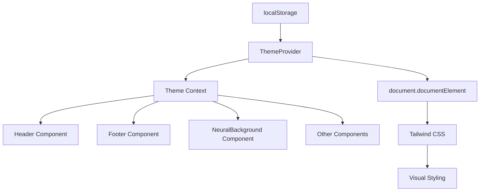
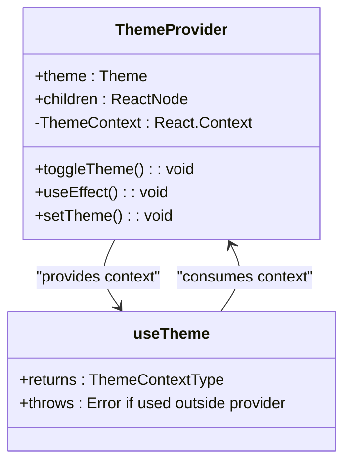
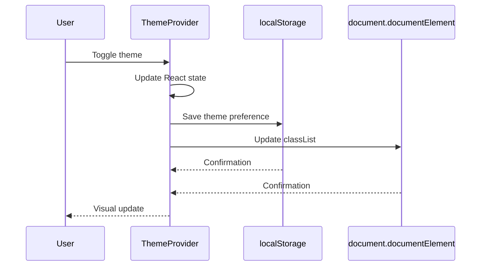
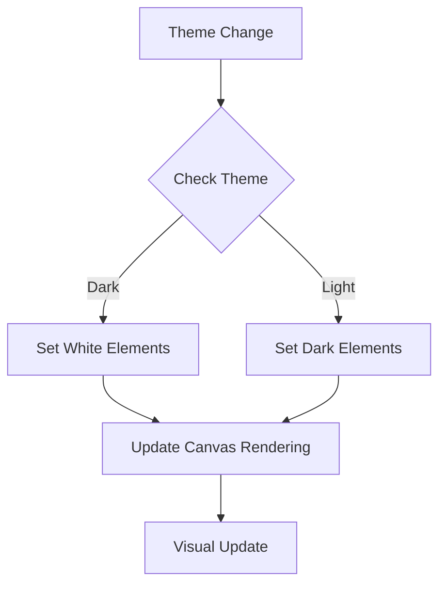
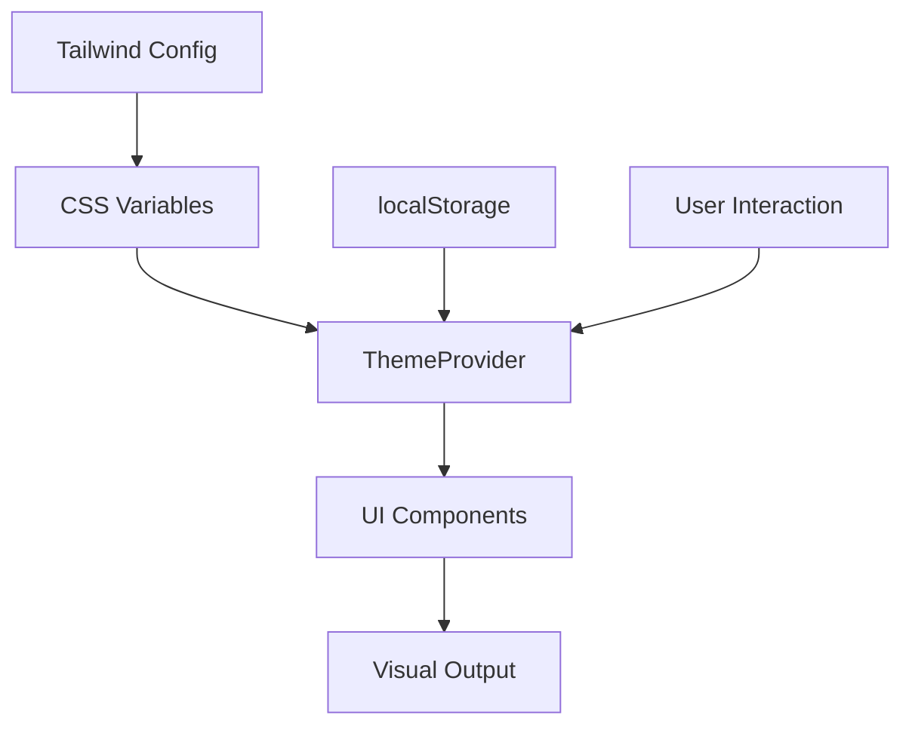

# Theme System

<cite>
**Referenced Files in This Document**   
- [ThemeProvider.tsx](file://src/app/components/ThemeProvider.tsx)
- [layout.tsx](file://src/app/layout.tsx)
- [Header.tsx](file://src/app/components/Header.tsx)
- [Footer.tsx](file://src/app/components/Footer.tsx)
- [NeuralBackground.tsx](file://src/app/components/NeuralBackground.tsx)
- [index.css](file://src/index.css)
- [tailwind.config.ts](file://tailwind.config.ts)
</cite>

## Table of Contents
1. [Theme System Overview](#theme-system-overview)
2. [Core Implementation](#core-implementation)
3. [Theme Context API](#theme-context-api)
4. [State Management and Persistence](#state-management-and-persistence)
5. [Theme-Aware Components](#theme-aware-components)
6. [CSS Variables and Styling](#css-variables-and-styling)
7. [Common Issues and Solutions](#common-issues-and-solutions)
8. [Extending the Theme System](#extending-the-theme-system)

## Theme System Overview

The theme system in async_coder implements a robust dark/light mode toggle using React Context for state management and localStorage for persistence. The system is designed to provide a seamless user experience by remembering theme preferences across sessions and applying consistent styling throughout the application.

The implementation follows a layered approach:
- **Context Layer**: Manages theme state using React Context API
- **Persistence Layer**: Stores user preferences in localStorage
- **Presentation Layer**: Applies theme-specific styles using CSS variables and Tailwind classes
- **Integration Layer**: Connects theme state to UI components

This architecture ensures that theme changes are reflected immediately across all components while maintaining performance and accessibility standards.

**Section sources**
- [ThemeProvider.tsx](file://src/app/components/ThemeProvider.tsx)
- [layout.tsx](file://src/app/layout.tsx)

## Core Implementation

The theme system is centered around the ThemeProvider component, which serves as the single source of truth for theme state. The provider wraps the entire application, making theme context available to all child components.



**Diagram sources**
- [ThemeProvider.tsx](file://src/app/components/ThemeProvider.tsx)
- [layout.tsx](file://src/app/layout.tsx)

**Section sources**
- [ThemeProvider.tsx](file://src/app/components/ThemeProvider.tsx)
- [layout.tsx](file://src/app/layout.tsx)

## Theme Context API

The theme system implements a custom React Context API that provides theme state and toggle functionality to consuming components.

### Context Structure

```typescript
type Theme = 'dark' | 'light'

interface ThemeContextType {
  theme: Theme
  toggleTheme: () => void
}
```

The context is created with proper TypeScript typing to ensure type safety throughout the application. The `useTheme` custom hook provides a convenient way for components to access the theme context with built-in error handling.



**Diagram sources**
- [ThemeProvider.tsx](file://src/app/components/ThemeProvider.tsx#L1-L48)

**Section sources**
- [ThemeProvider.tsx](file://src/app/components/ThemeProvider.tsx#L1-L48)

## State Management and Persistence

The theme system implements a two-phase state management approach that combines React's useState hook with localStorage persistence.

### Initialization Phase

On component mount, the ThemeProvider checks localStorage for a saved theme preference:

```typescript
useEffect(() => {
  const savedTheme = localStorage.getItem('theme') as Theme | null
  if (savedTheme) {
    setTheme(savedTheme)
  } else {
    setTheme('light')
  }
}, [])
```

This ensures that returning users have their previous theme preference restored.

### Update Phase

When the theme changes, the system updates both the React state and localStorage:

```typescript
useEffect(() => {
  if (theme === 'dark') {
    document.documentElement.classList.add('dark')
  } else {
    document.documentElement.classList.remove('dark')
  }
  localStorage.setItem('theme', theme)
}, [theme])
```



**Diagram sources**
- [ThemeProvider.tsx](file://src/app/components/ThemeProvider.tsx#L15-L30)

**Section sources**
- [ThemeProvider.tsx](file://src/app/components/ThemeProvider.tsx#L15-L30)

## Theme-Aware Components

Several components in the application consume the theme context to provide theme-specific functionality and styling.

### Header Component

The Header component uses the theme context to:
- Display appropriate icon (Sun/Moon) based on current theme
- Apply theme-specific styling to interactive elements
- Adjust visual effects based on theme

```tsx
const { theme, toggleTheme } = useTheme()

<button onClick={toggleTheme}>
  {theme === 'dark' ? <Sun size={18} /> : <Moon size={18} />}
</button>
```

### NeuralBackground Component

The NeuralBackground component uses the theme context to adjust canvas rendering:

```tsx
const { theme } = useTheme()

useEffect(() => {
  const isDark = theme === 'dark'
  const pointColor = isDark ? 'rgba(255, 255, 255, 0.5)' : 'rgba(10, 10, 12, 0.5)'
  const lineColor = isDark ? 'rgba(255, 255, 255, 0.1)' : 'rgba(10, 10, 12, 0.1)'
  // ... rendering logic
}, [theme])
```



**Section sources**
- [Header.tsx](file://src/app/components/Header.tsx#L5-L10)
- [NeuralBackground.tsx](file://src/app/components/NeuralBackground.tsx#L12-L20)

## CSS Variables and Styling

The theme system leverages CSS variables and Tailwind CSS for styling, providing a flexible and maintainable approach to theme-specific design.

### CSS Variable Definition

The system defines theme-specific CSS variables in the global stylesheet:

```css
:root {
  /* Dark mode variables */
  --bg-primary: #0a0a0c;
  --text-primary: #f0f0f0;
  /* ... other variables */
}

:root[class~="light"] {
  --bg-primary: #ffffff;
  --text-primary: #1e293b;
  /* ... other variables */
}
```

### Tailwind Configuration

Tailwind is configured to use the CSS variables for theme-aware styling:

```javascript
module.exports = {
  darkMode: "selector",
  theme: {
    extend: {
      colors: {
        background: "hsl(var(--background))",
        foreground: "hsl(var(--foreground))",
        // ... other color mappings
      }
    }
  }
}
```

Components use both CSS variables and Tailwind's dark variant classes:

```tsx
// Using CSS variables
<div style={{ background: 'var(--bg-primary)' }}>

// Using Tailwind dark classes
<button className="text-gray-700 dark:text-gray-300">
```



**Diagram sources**
- [index.css](file://src/index.css#L10-L110)
- [tailwind.config.ts](file://tailwind.config.ts#L1-L73)

**Section sources**
- [index.css](file://src/index.css#L10-L110)
- [tailwind.config.ts](file://tailwind.config.ts#L1-L73)

## Common Issues and Solutions

### Flash of Incorrect Theme (FOIT)

A common issue in theme systems is the flash of incorrect theme during page load. This occurs when the default theme is rendered before localStorage is checked.

**Solution**: The current implementation minimizes this by setting the initial state to 'light' and immediately checking localStorage. For improved UX, consider adding a loading state or using a higher-level provider.

### Hydration Mismatch

When server-side rendering is involved, theme state might differ between server and client.

**Solution**: The current client-only implementation avoids this issue by only initializing theme state on the client side after mount.

### Accessibility Considerations

The system includes proper aria-labels for the theme toggle button:
```tsx
aria-label={`Switch to ${theme === 'dark' ? 'light' : 'dark'} mode`}
```

This ensures screen readers can properly announce the button's function.

**Section sources**
- [ThemeProvider.tsx](file://src/app/components/ThemeProvider.tsx)
- [Header.tsx](file://src/app/components/Header.tsx)

## Extending the Theme System

The theme system can be extended to support additional features:

### Multiple Theme Modes

To add system preference detection:
```typescript
useEffect(() => {
  const prefersDark = window.matchMedia('(prefers-color-scheme: dark)').matches
  const savedTheme = localStorage.getItem('theme') as Theme | null
  
  if (savedTheme) {
    setTheme(savedTheme)
  } else {
    setTheme(prefersDark ? 'dark' : 'light')
  }
}, [])
```

### Additional Theme Variants

The system could be extended to support more than two themes by modifying the Theme type:
```typescript
type Theme = 'dark' | 'light' | 'solarized' | 'dracula'
```

### Theme Configuration

A theme configuration object could be introduced to manage theme-specific settings:
```typescript
const themeConfig = {
  dark: {
    primary: '#f24d33',
    secondary: '#00c2ff',
    // ... other settings
  },
  light: {
    primary: '#f24d33',
    secondary: '#00c2ff',
    // ... other settings
  }
}
```

**Section sources**
- [ThemeProvider.tsx](file://src/app/components/ThemeProvider.tsx)